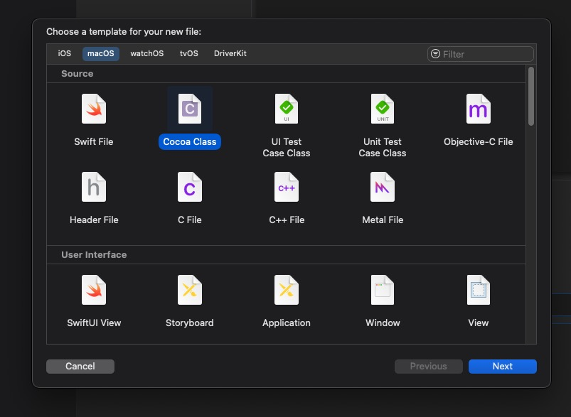
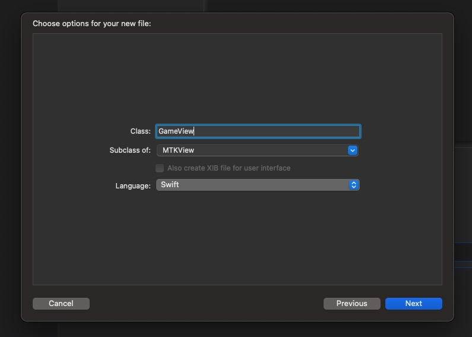
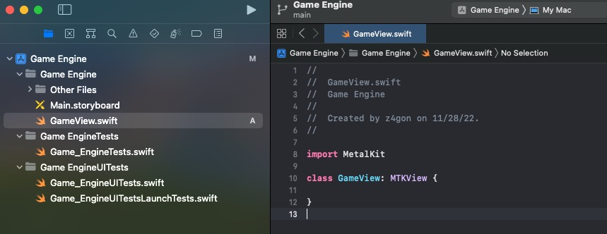
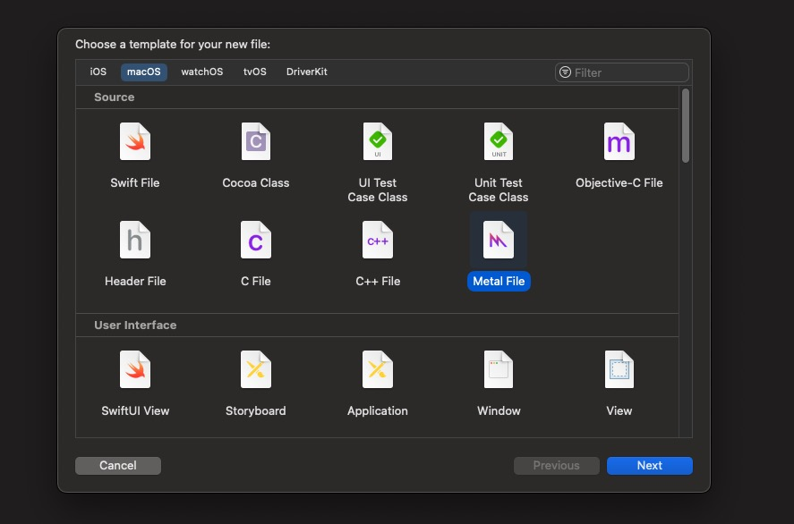
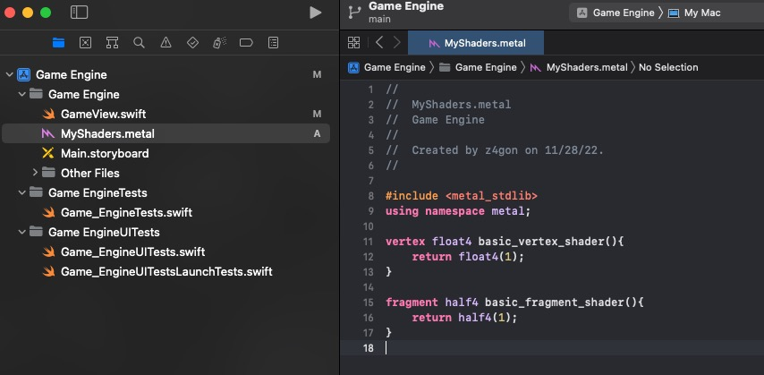
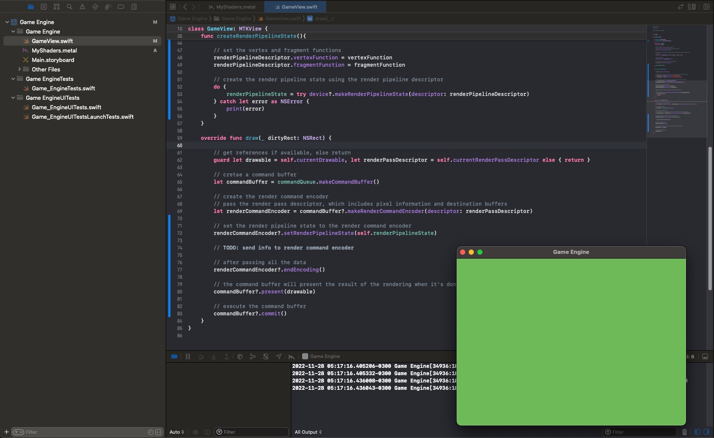
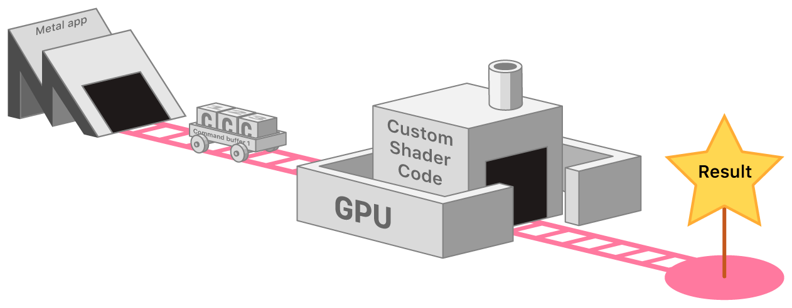
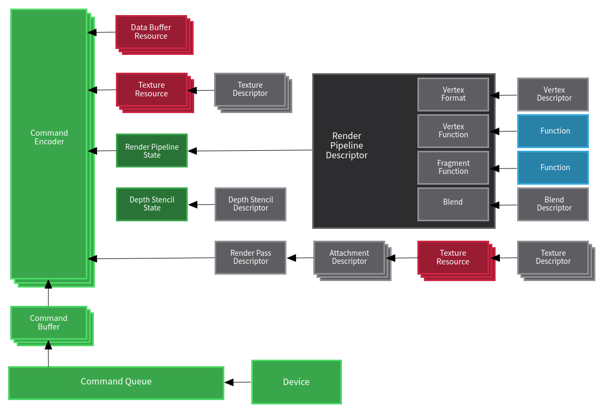

# Render Pipeline

[Back to Dev Log](../README.md)

## Resources

- [Metal Render Pipeline](https://developer.apple.com/documentation/metal/using_a_render_pipeline_to_render_primitives)
  - [Introduction to Metal](https://lcellentani.github.io/post/metal_introduction/)
- [MTK View](https://developer.apple.com/documentation/metalkit/mtkview)
- [MTL Device](https://developer.apple.com/documentation/metal/mtldevice)
  - [MTL Pixel Format](https://developer.apple.com/documentation/metal/mtlpixelformat)
  - [MTL Command Queue](https://developer.apple.com/documentation/metal/mtlcommandqueue)
- [Setting up a Command Structure](https://developer.apple.com/documentation/metal/gpu_devices_and_work_submission/setting_up_a_command_structure)
  - [MTL Command Buffer](https://developer.apple.com/documentation/metal/mtlcommandbuffer)
  - [MTL Command Encoder](https://developer.apple.com/documentation/metal/mtlcommandencoder)
    - [MTL Render Command Encoder](https://developer.apple.com/documentation/metal/mtlrendercommandencoder)
- [MTL Render Pass Descriptor](https://developer.apple.com/documentation/metal/mtlrenderpassdescriptor)
- [MTL Render Pipeline State](https://developer.apple.com/documentation/metal/mtlrenderpipelinestate)
  - [MTL Render Pipeline Descriptor](https://developer.apple.com/documentation/metal/mtlrenderpipelinedescriptor)
    - Color Attachments
      - Pixel Format
    - Vertex/Fragment Functions
      - [MTL Library](https://developer.apple.com/documentation/metal/mtllibrary)
        - [MTL Function Type](https://developer.apple.com/documentation/metal/mtlfunctiontype)
          - Vertex/Fragment/Kernel
        - [MTL Function](https://developer.apple.com/documentation/metal/mtlfunction)
          - **.metal** files

## Create a MTKView

```swift
import MetalKit

class GameView: MTKView {

    var commandQueue: MTLCommandQueue!
    var renderPipelineState: MTLRenderPipelineState!

    required init(coder: NSCoder) {
        super.init(coder: coder)

        // device is an abstract representation of the GPU
        // allows to create Metal GPU objects and send them down to the GPU
        self.device = MTLCreateSystemDefaultDevice()

        // clearColor fills the screen each time the GPU clears the frame (60 times per second at 60 fps)
        // rgba is 0-1
        self.clearColor = MTLClearColor(red: 0.43, green: 0.73, blue: 0.35, alpha: 1.0)

        // how pixels are stored
        self.colorPixelFormat = MTLPixelFormat.bgra8Unorm

        // create the command queue to handle commands for the GPU
        self.commandQueue = device?.makeCommandQueue()

        createRenderPipelineState()
    }

    func createRenderPipelineState(){

        let library = device?.makeDefaultLibrary()

        // at compile time it will pick the right vertex and shader functions by matching the names
        let vertexFunction = library?.makeFunction(name: "basic_vertex_shader")
        let fragmentFunction = library?.makeFunction(name: "basic_fragment_shader")

        // create the descriptor for the render pipeline, make the pixel format match the device
        let renderPipelineDescriptor = MTLRenderPipelineDescriptor()
        renderPipelineDescriptor.colorAttachments[0].pixelFormat = MTLPixelFormat.bgra8Unorm

        // set the vertex and fragment functions
        renderPipelineDescriptor.vertexFunction = vertexFunction
        renderPipelineDescriptor.fragmentFunction = fragmentFunction

        // create the render pipeline state using the render pipeline descriptor
        do {
            renderPipelineState = try device?.makeRenderPipelineState(descriptor: renderPipelineDescriptor)
        } catch let error as NSError {
            print(error)
        }
    }

    override func draw(_ dirtyRect: NSRect) {

        // get references if available, else return
        guard let drawable = self.currentDrawable, let renderPassDescriptor = self.currentRenderPassDescriptor else { return }

        // cretae a command buffer
        let commandBuffer = commandQueue.makeCommandBuffer()

        // create the render command encoder
        // pass the render pass descriptor, which includes pixel information and destination buffers
        let renderCommandEncoder = commandBuffer?.makeRenderCommandEncoder(descriptor: renderPassDescriptor)

        // set the render pipeline state to the render command encoder
        renderCommandEncoder?.setRenderPipelineState(self.renderPipelineState)

        // TODO: send info to render command encoder

        // after passing all the data
        renderCommandEncoder?.endEncoding()

        // the command buffer will present the result of the rendering when it's done
        commandBuffer?.present(drawable)

        // execute the command buffer
        commandBuffer?.commit()
    }
}
```





## Create very basic Shaders




## Render empty screen



## Command Structure





## Render Pipeline


