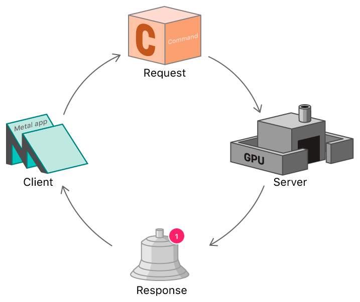

# Render Pipeline

[Back to Dev Log](../README.md)

## Resources

- [Metal Render Pipeline](https://developer.apple.com/documentation/metal/using_a_render_pipeline_to_render_primitives)
  - [Introduction to Metal](https://lcellentani.github.io/post/metal_introduction/)
- [MTK View](https://developer.apple.com/documentation/metalkit/mtkview)
- [MTL Device](https://developer.apple.com/documentation/metal/mtldevice)
  - [MTL Pixel Format](https://developer.apple.com/documentation/metal/mtlpixelformat)
  - [MTL Command Queue](https://developer.apple.com/documentation/metal/mtlcommandqueue)
- [Setting up a Command Structure](https://developer.apple.com/documentation/metal/gpu_devices_and_work_submission/setting_up_a_command_structure)
  - [MTL Command Buffer](https://developer.apple.com/documentation/metal/mtlcommandbuffer)
  - [MTL Command Encoder](https://developer.apple.com/documentation/metal/mtlcommandencoder)
    - [MTL Render Command Encoder](https://developer.apple.com/documentation/metal/mtlrendercommandencoder)
- [MTL Render Pass Descriptor](https://developer.apple.com/documentation/metal/mtlrenderpassdescriptor)
- [MTL Render Pipeline State](https://developer.apple.com/documentation/metal/mtlrenderpipelinestate)
  - [MTL Render Pipeline Descriptor](https://developer.apple.com/documentation/metal/mtlrenderpipelinedescriptor)
    - Color Attachments
      - Pixel Format
    - Vertex/Fragment Functions
      - [MTL Library](https://developer.apple.com/documentation/metal/mtllibrary)
        - [MTL Function Type](https://developer.apple.com/documentation/metal/mtlfunctiontype)
          - Vertex/Fragment/Kernel
        - [MTL Function](https://developer.apple.com/documentation/metal/mtlfunction)
          - **.metal** files

## Create a MTKView

[See Class](../../Game%20Engine/GameView.swift)

## Command Structure

## Render Pipeline

