# Part 1: Setting up the basic Render Pipeline

[Back to Dev Log](../README.md)

## References

- [Metal Render Pipeline tutorial series by Rick Twohy](https://www.youtube.com/playlist?list=PLEXt1-oJUa4BVgjZt9tK2MhV_DW7PVDsg)
- [Introduction to Metal by Ludovico Cellentani](https://lcellentani.github.io/post/metal_introduction/)

---

## Table of Content

- [Creating the XCode project](#creating-the-xcode-project)
- [MTKView](#mtkview)
- [The Command Structure](#the-command-structure)
  - [Resources](#resources)
- [Basic Render Pipeline](#basic-render-pipeline)
  - [Code](#code)
    - [Shaders](#shaders)
    - [Game View](#game-view)
  - [Result](#result)

---

## Creating the XCode project

We just need to create a very basic **macOS** app using **Swift** and **Storyboards** for the UI.

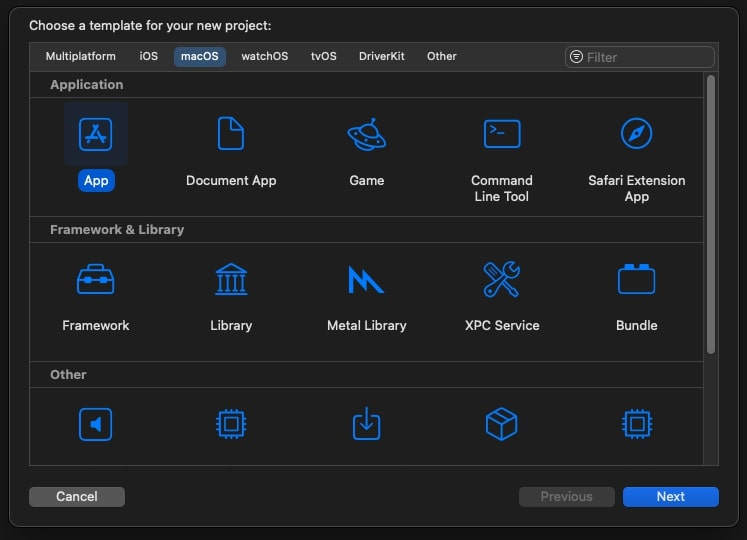
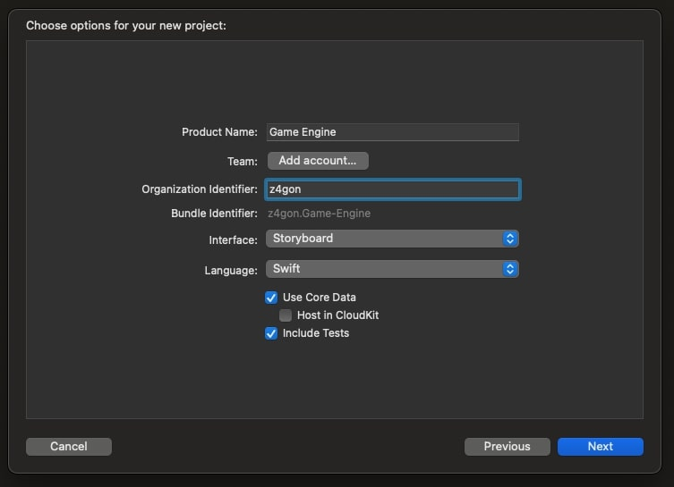

---

## MTKView

- [MTK View](https://developer.apple.com/documentation/metalkit/mtkview)

Create a new **Cocoa Class** file, extending from **MTKView**, which in turn extends **NSView**.

This will be connected to your main **Storyboard** for the **Game View**, where we will output the rendering of the pipeline.

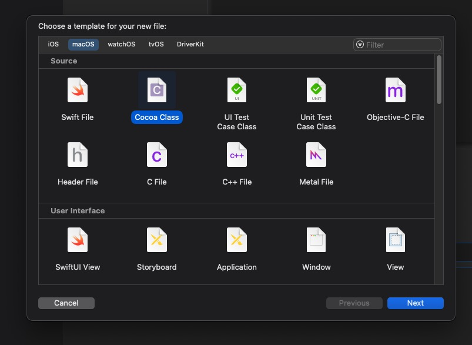
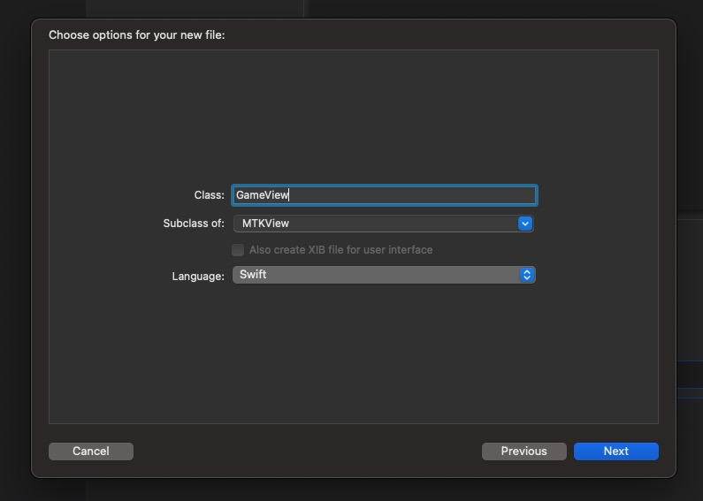
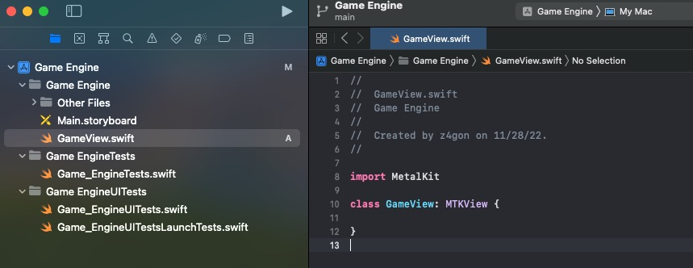

---

## The Command Structure

[Command Structure Images from Apple Docs](https://developer.apple.com/documentation/metal/gpu_devices_and_work_submission/setting_up_a_command_structure)

The **Metal** Graphics **API** uses a **Command Structure** to handle all the petitions from the **CPU** to render graphics in the **GPU**.

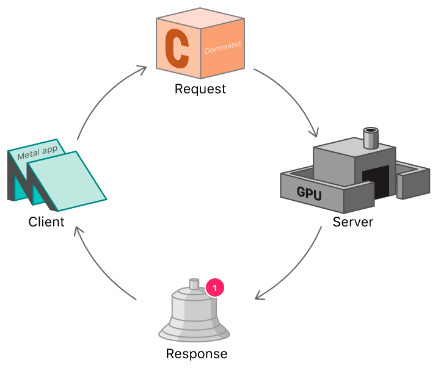
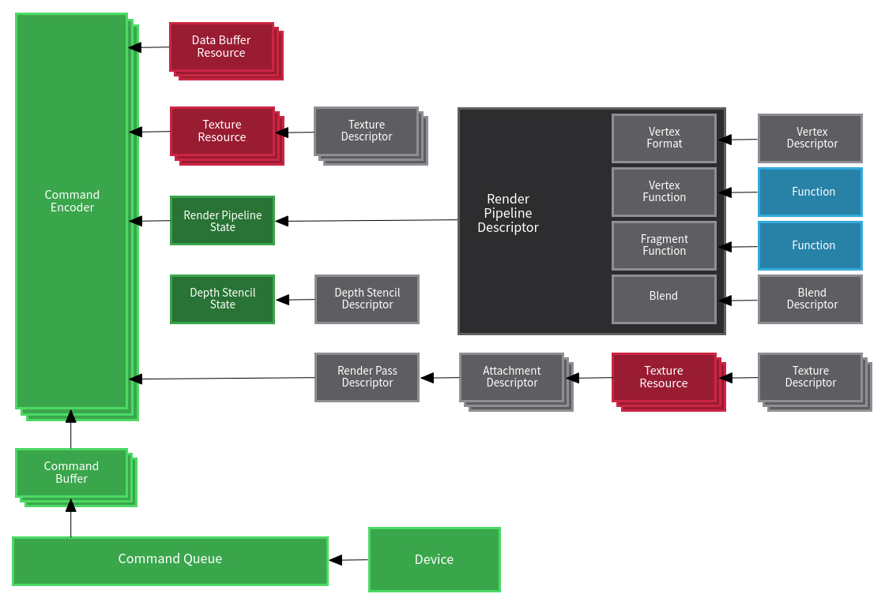

[Render Pipeline Descriptor Image Source](https://lcellentani.github.io/post/metal_introduction/)

The **Command Buffers** contain the instructions the the **CPU** needs to execute.


The **Command Queue** holds all the **Command Buffers** and ensures they execute timely and in order. It also handles executions and results coming to/from **Compute Shaders**.
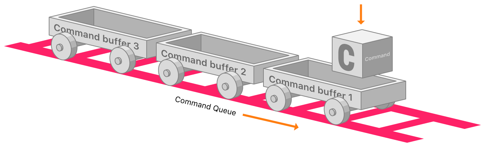

### Resources

- [Metal Render Pipeline](https://developer.apple.com/documentation/metal/using_a_render_pipeline_to_render_primitives)

  - [Introduction to Metal by Ludovico Cellentani](https://lcellentani.github.io/post/metal_introduction/)

- [Setting up a Command Structure](https://developer.apple.com/documentation/metal/gpu_devices_and_work_submission/setting_up_a_command_structure)
  - [MTL Command Buffer](https://developer.apple.com/documentation/metal/mtlcommandbuffer)
  - [MTL Command Encoder](https://developer.apple.com/documentation/metal/mtlcommandencoder)
    - [MTL Render Command Encoder](https://developer.apple.com/documentation/metal/mtlrendercommandencoder)
- [MTL Render Pass Descriptor](https://developer.apple.com/documentation/metal/mtlrenderpassdescriptor)
- [MTL Render Pipeline State](https://developer.apple.com/documentation/metal/mtlrenderpipelinestate)

  - [MTL Render Pipeline Descriptor](https://developer.apple.com/documentation/metal/mtlrenderpipelinedescriptor)
    - Color Attachments
      - Pixel Format
    - Vertex/Fragment Functions
      - [MTL Library](https://developer.apple.com/documentation/metal/mtllibrary)
        - [MTL Function Type](https://developer.apple.com/documentation/metal/mtlfunctiontype)
          - Vertex/Fragment/Kernel
        - [MTL Function](https://developer.apple.com/documentation/metal/mtlfunction)
          - **.metal** files

- [MTL Device](https://developer.apple.com/documentation/metal/mtldevice)
  - [MTL Pixel Format](https://developer.apple.com/documentation/metal/mtlpixelformat)
  - [MTL Command Queue](https://developer.apple.com/documentation/metal/mtlcommandqueue)

---

## Basic Render Pipeline

1. The **Device** represents the **GPU** device in the machine.
1. From the **Device**, we create the **Commmand Queue**.
1. We create **Command Buffers** using the **Command Queue**.
1. The **Render Command Encoder** is created out of the **Command Buffer** (There are many types of **Command Encoders**, **Render** is for Graphics Rendering, **Compute** would be for Computations, as in Compute Shaders)
   1. We use the **Render Pass Descriptor** for this, which includes information about the output buffers to show the result of the rendering.
1. At one point we will set the **Render Pipeline State** to the **Render Command Encoder**.
1. To create the **Render Pipeline State**, we first need to create the **Render Pipeline Descriptor**.
   1. For creating the **Render Pipeline Descriptor**, we need to create a **Library** first, which will let us create the **Functions** for **Vertex** and **Fragment** calculations.
   2. Once we have the **Library** and the **Functions**, we can create the **Render Pipeline Descriptor**.
   3. With the **Render Pipeline Descriptor**, we can tell the **Device** to create the **Render Pipeline State**.
1. Now we can set the **Render Pipeline State** to the **Render Command Encoder**.
1. And we can tell the **Command Buffer** to **endEncoding()**, **present()** to the **drawable**, and **commit()** to schedule its execution.

### Code

#### Shaders

For defining the **Shaders**, we need to create a **Metal** file.

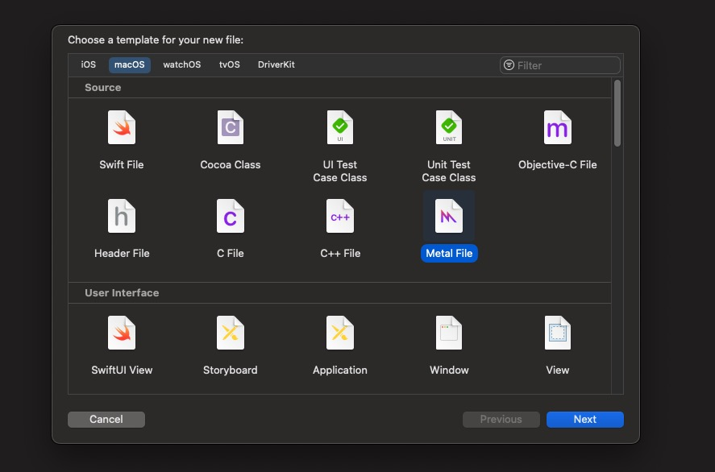
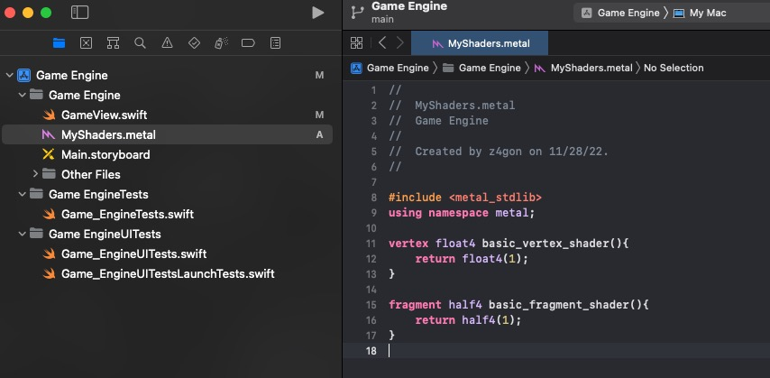

```c
#include <metal_stdlib>
using namespace metal;

vertex float4 basic_vertex_shader(){
    return float4(1);
}

fragment half4 basic_fragment_shader(){
    return half4(1);
}
```

#### Game View

For now this will just clear the screen with a basic green color, every frame.

```swift
import MetalKit

class GameView: MTKView {

    var commandQueue: MTLCommandQueue!
    var renderPipelineState: MTLRenderPipelineState!

    required init(coder: NSCoder) {
        super.init(coder: coder)

        // device is an abstract representation of the GPU
        // allows to create Metal GPU objects and send them down to the GPU
        self.device = MTLCreateSystemDefaultDevice()

        // clearColor fills the screen each time the GPU clears the frame (60 times per second at 60 fps)
        // rgba is 0-1
        self.clearColor = MTLClearColor(red: 0.43, green: 0.73, blue: 0.35, alpha: 1.0)

        // how pixels are stored
        self.colorPixelFormat = MTLPixelFormat.bgra8Unorm

        // create the command queue to handle commands for the GPU
        self.commandQueue = device?.makeCommandQueue()

        createRenderPipelineState()
    }

    func createRenderPipelineState(){

        let library = device?.makeDefaultLibrary()

        // at compile time it will pick the right vertex and shader functions by matching the names
        let vertexFunction = library?.makeFunction(name: "basic_vertex_shader")
        let fragmentFunction = library?.makeFunction(name: "basic_fragment_shader")

        // create the descriptor for the render pipeline, make the pixel format match the device
        let renderPipelineDescriptor = MTLRenderPipelineDescriptor()
        renderPipelineDescriptor.colorAttachments[0].pixelFormat = MTLPixelFormat.bgra8Unorm

        // set the vertex and fragment functions
        renderPipelineDescriptor.vertexFunction = vertexFunction
        renderPipelineDescriptor.fragmentFunction = fragmentFunction

        // create the render pipeline state using the render pipeline descriptor
        do {
            renderPipelineState = try device?.makeRenderPipelineState(descriptor: renderPipelineDescriptor)
        } catch let error as NSError {
            print(error)
        }
    }

    override func draw(_ dirtyRect: NSRect) {

        // get references if available, else return
        guard let drawable = self.currentDrawable, let renderPassDescriptor = self.currentRenderPassDescriptor else { return }

        // cretae a command buffer
        let commandBuffer = commandQueue.makeCommandBuffer()

        // create the render command encoder
        // pass the render pass descriptor, which includes pixel information and destination buffers
        let renderCommandEncoder = commandBuffer?.makeRenderCommandEncoder(descriptor: renderPassDescriptor)

        // set the render pipeline state to the render command encoder
        renderCommandEncoder?.setRenderPipelineState(self.renderPipelineState)

        // TODO: send info to render command encoder

        // after passing all the data
        renderCommandEncoder?.endEncoding()

        // the command buffer will present the result of the rendering when it's done
        commandBuffer?.present(drawable)

        // execute the command buffer
        commandBuffer?.commit()
    }
}
```

### Result

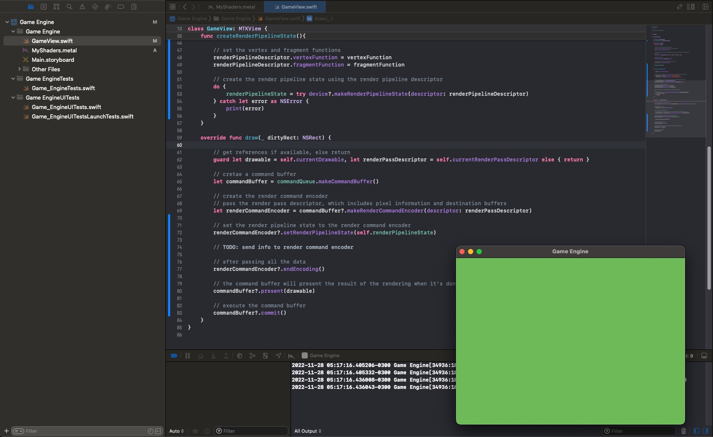
