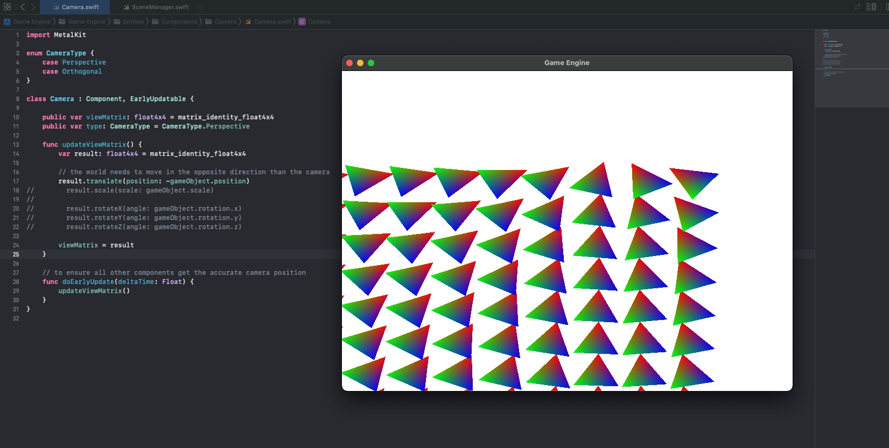

# Part 10: Camera and View Matrix

[Back to Readme](../../README.md)

## References

- [Metal Render Pipeline tutorial series by Rick Twohy](https://www.youtube.com/playlist?list=PLEXt1-oJUa4BVgjZt9tK2MhV_DW7PVDsg)

---

## Table of Content

- [Camera Component](#camera-component)
- [Scene](#scene)
- [Shader](#shader)
- [Result](#result)

---

## Camera Component

The **Camera** is implemented as a **component** attached to a **game object**, it reuses the **position** of the **transform** to calculate the **view matrix**.

The calculation of the **view matrix** is done in the early update method.

```swift
class Camera : Component, EarlyUpdatable {

    public var viewMatrix: float4x4 = matrix_identity_float4x4
    public var type: CameraType = CameraType.Perspective

    func updateViewMatrix() {
        var result: float4x4 = matrix_identity_float4x4

        // the world needs to move in the opposite direction than the camera
        result.translate(position: -gameObject.position)
//        result.scale(scale: gameObject.scale)
//
//        result.rotateX(angle: gameObject.rotation.x)
//        result.rotateY(angle: gameObject.rotation.y)
//        result.rotateZ(angle: gameObject.rotation.z)

        viewMatrix = result
    }

    // to ensure all other components get the accurate camera position
    func doEarlyUpdate(deltaTime: Float) {
        updateViewMatrix()
    }
}
```

The **Debug Camera** will use the arrow keys to move horizontally and vertically.

This is done in the **early update** as well, so that other components can use the accurate camera position. (Such as getting the world position corresponding to the mouse position)

```swift
class DebugCameraComponent : Camera {

    override func doEarlyUpdate(deltaTime: Float) {

        if(Keyboard.isKeyPressed(KeyCodes.upArrow)){
            gameObject.position.y += deltaTime
        }

        if(Keyboard.isKeyPressed(KeyCodes.downArrow)){
            gameObject.position.y -= deltaTime
        }

        if(Keyboard.isKeyPressed(KeyCodes.leftArrow)){
            gameObject.position.x -= deltaTime
        }

        if(Keyboard.isKeyPressed(KeyCodes.rightArrow)){
            gameObject.position.x += deltaTime
        }

        super.doEarlyUpdate(deltaTime: deltaTime)
    }
}
```

The components can then use the camera position when trying to get the mouse position in the screen.

```swift
public static func getMouseViewportPosition(_ camera: Camera)->float2{
    let viewportPosition = getMouseViewportPosition()
    return float2(viewportPosition.x + camera.gameObject.position.x, viewportPosition.y + camera.gameObject.position.y)
}
```

---

## Scene

The **Scene** now holds a struct with the Scene Constants, which will include the **view matrix** and the **projection matrix** for the **perspective projection**.

The **view matrix** is updated by the camera itself, and since the camera will be used as the main camera in the scene, it will be used to update the view matrix in the scene.

**Once** per render cycle, the scene will pass the **Scene Constants** with the **view matrix** to the **GPU** as bytes by value. Similarly to how the Mesh Renderer passes the model constants with the model matrix to the GPU.

```swift
class Scene : Transform {

    private var _sceneConstants: SceneConstants! = SceneConstants()

    func updateSceneConstants() {
        _sceneConstants.viewMatrix = CameraManager.mainCamera.viewMatrix
    }

    override func render(renderCommandEncoder: MTLRenderCommandEncoder) {

        updateSceneConstants()

        // set the view matrix
        renderCommandEncoder.setVertexBytes(&_sceneConstants, length: SceneConstants.stride, index: 2)

        super.render(renderCommandEncoder: renderCommandEncoder)
    }
}
```

---

## Shader

The **Vertex Shader** function will pick up the **Scene Constants** and the **view matrix** off of the buffer.

It will multiply the matrices with the object space position of the vertex, to transform the coordinates to view space.

```c
float4 viewSpaceCoordinates = viewMatrix * modelMatrix * objectSpaceCoordinates
```

```c
vertex FragmentData basic_vertex_shader(
  // metal can infer the data because we are describing it using the vertex descriptor
  const VertexData IN [[ stage_in ]],
  constant ModelConstants &modelConstants [[ buffer(1) ]],
  constant SceneConstants &sceneConstants [[ buffer(2) ]]
){
    FragmentData OUT;

    // return the vertex position in homogeneous screen space
    // ProjectionMatrix * ViewMatrix * ModelMatrix * ObjectPosition = HSCPosition
    OUT.position = sceneConstants.viewMatrix * modelConstants.modelMatrix * float4(IN.position, 1);

    OUT.color = IN.color;

    return OUT;
}
```

---

## Result

Pressing the keyboard arrows now moves the camera along the x and y coordinates.




