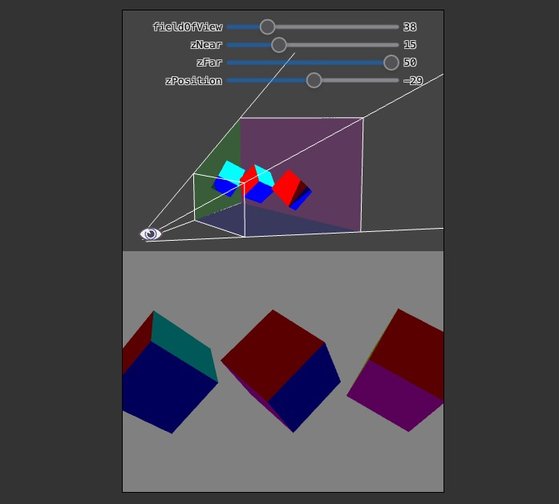

# Part 11: 3D Perspective Projection Matrix

[Back to Dev Log](../README.md)

## References

- [Metal Render Pipeline tutorial series by Rick Twohy](https://www.youtube.com/playlist?list=PLEXt1-oJUa4BVgjZt9tK2MhV_DW7PVDsg)
- [3D Perspective Projection Matrix](https://gamedev.stackexchange.com/questions/120338/what-does-a-perspective-projection-matrix-look-like-in-opengl)
- [3D Perspective Projection Matrix in Action](https://webglfundamentals.org/webgl/lessons/webgl-3d-perspective.html)
- [Projecting a Cube](https://glumpy.readthedocs.io/en/latest/tutorial/cube-ugly.html)
- [Calculating Primitive Visibility Using Depth Testing](https://developer.apple.com/documentation/metal/render_passes/calculating_primitive_visibility_using_depth_testing)
- [OpenGL - clip space, NDC, and screen space](https://www.youtube.com/watch?v=pThw0S8MR7w)

---

## Table of Content

- [3D Perspective Projection Matrix](#3d-perspective-projection-matrix)
  - [View Frustrum](#view-frustrum)
  - [Clipping](#clipping)
  - [Matrix](#matrix)
- [Cube Mesh](#cube-mesh)
- [Depth Stencil](#depth-stencil)
  - [Depth Stencil Descriptor](#depth-stencil-descriptor)
  - [Depth Stencil State](#depth-stencil-state)
  - [Depth Stencil Pixel Format](#depth-stencil-pixel-format)
- [Mesh Renderer](#mesh-renderer)
- [Camera](#camera)
- [Scene](#scene)
- [Shader](#shader)

---

## 3D Perspective Projection Matrix

### View Frustrum

Projecting 3D objects onto a flat surface means connecting each vertex to the position of the camera, and pin pointing where that line crosses the near clip plane.


[Image Source 🔗](https://glumpy.readthedocs.io/en/latest/tutorial/cube-ugly.html)

### Clipping

The near and far clip planes determine what gets rendered in terms of depth.

The field of view means how much stuff gets into the projection in terms of bounds vertically and horizontally.



[Image Source 🔗](https://webglfundamentals.org/webgl/lessons/webgl-3d-perspective.html)

### Matrix

All the calculations can be put into a pre-determined matrix that can be multiplied by a position vector and it will return the homogenous clip space coordinates.

Metal will then translate these to Normalized Device Coordinates ranging from (-1, -1) to (1, 1) and including depth.

Finally this will be translated to screen space as x, y coordinates in pixels.


[Image Source 🔗](https://gamedev.stackexchange.com/questions/120338/what-does-a-perspective-projection-matrix-look-like-in-opengl)

This is what it looks like in code:

```swift
mutating func projectPerspective(fieldOfView: Float, aspectRatio: Float, farClippingDistance: Float, nearClippingDistance: Float) {
    var result = matrix_identity_float4x4

    let fov = fieldOfView
    let aspect = aspectRatio
    let far = farClippingDistance
    let near = nearClippingDistance

    result.columns = (
        float4(Float(1) / ( aspect * tan(fov / Float(2)) ), 0, 0, 0),
        float4(0, Float(2) / tan(fov / Float(2)), 0, 0),
        float4(0, 0, -((far + near)/(far - near)), -1),
        float4(0, 0, -((2 * far * near)/(far - near)), 0)
    )

    self = matrix_multiply(self, result)
}
```

---

## Cube Mesh

To define a cube mesh, we need just 8 vertices.

And then an array of indexes to define all the counter clockwise triangles that will make up the quad faces.

```swift
class CubeMesh : Mesh{
    override func createMesh() {
        vertices = [
            Vertex(position: float3( 0.5, 0.5, 0.5), color: float4(1,0,0,1)), // FRONT Top Right
            Vertex(position: float3(-0.5, 0.5, 0.5), color: float4(0,1,0,1)), // FRONT Top Left
            Vertex(position: float3(-0.5,-0.5, 0.5), color: float4(0,0,1,1)), // FRONT Bottom Left
            Vertex(position: float3( 0.5,-0.5, 0.5), color: float4(1,0,1,1)),  // FRONT Bottom Right

            Vertex(position: float3( 0.5, 0.5, -0.5), color: float4(0,0,1,1)), // BACK Top Right
            Vertex(position: float3(-0.5, 0.5, -0.5), color: float4(1,0,1,1)), // BACK Top Left
            Vertex(position: float3(-0.5,-0.5, -0.5), color: float4(1,0,0,1)), // BACK Bottom Left
            Vertex(position: float3( 0.5,-0.5, -0.5), color: float4(0,1,0,1))  // BACK Bottom Right
        ]

        // counter clockwise mean out facing
        indices = [

            // FRONT face
            0,1,2,
            0,2,3,

            // BACK face
            5,4,7,
            5,7,6,

            // TOP face
            4,5,1,
            4,1,0,

            // BOTTOM face
            6,7,3,
            6,3,2,

            // LEFT face
            1,5,6,
            1,6,2,

            // RIGHT face
            4,0,3,
            4,3,7
        ]
    }
}
```

---

## Depth Stencil

### Depth Stencil Descriptor

To let the **GPU** know what vertices are **farther away** from the **camera**, and then be able to clip them using the **Depth Test**, we need to setup the **Depth Stencil Descriptor**.

### Depth Stencil State

We will use the descriptor to create the **Depth Stencil State**, and pass it on to the **Render Command Encoder**.

```swift
public struct LessDepthStencilState: DepthStencilState {
    var name: String = "Less DepthTest"
    var depthStencilState: MTLDepthStencilState!

    init(){

        let depthStencilDescriptor = MTLDepthStencilDescriptor()
        depthStencilDescriptor.depthCompareFunction = MTLCompareFunction.less
        depthStencilDescriptor.isDepthWriteEnabled = true

        depthStencilState = Engine.device.makeDepthStencilState(descriptor: depthStencilDescriptor)
    }
}
```

### Depth Stencil Pixel Format

The **Render Pipeline Descriptor** and the **MTKView** will both need to set the **Depth Stencil Pixel Format** as well, just like they set the **Color Pixel Format**.

```swift
public struct BasicRenderPipelineDescriptor: RenderPipelineDescriptor{
    ...

    init(){

        ...

        // make the pixel format match the device
        renderPipelineDescriptor.colorAttachments[0].pixelFormat = Preferences.PixelFormat
        renderPipelineDescriptor.depthAttachmentPixelFormat = Preferences.DepthStencilPixelFormat

        ...
    }
}
```

```swift
class GameView: MTKView {

    var renderer: GameViewRenderer!

    required init(coder: NSCoder) {
        super.init(coder: coder)

        device = MTLCreateSystemDefaultDevice()
        clearColor = Preferences.ClearColor
        colorPixelFormat = Preferences.PixelFormat
        depthStencilPixelFormat = Preferences.DepthStencilPixelFormat

        Engine.initialize(device: device!)

        renderer = GameViewRenderer(self)
        delegate = renderer
    }
}
```

---

## Mesh Renderer

The mesh renderer will pass the **Depth Stencil State** to the **Render Command Encoder**.

```swift
func doRender(renderCommandEncoder: MTLRenderCommandEncoder) {
    ...
    renderCommandEncoder.setDepthStencilState(DepthStencilStateCache.getDepthStencilState(.Less))
    ...
}
```

---

## Camera

The camera will use its properties to calculate the **Perspective Projection Matrix**.

```swift
class Camera : Component, EarlyUpdatable {

    public var viewMatrix: float4x4 = matrix_identity_float4x4
    public var projectionMatrix: float4x4 = matrix_identity_float4x4

    public var type: CameraType = CameraType.Perspective

    public var fieldOfView: Float = 60
    public var nearClippingDistance: Float = 0.1
    public var farClippingDistance: Float = 1000

    ...

    func updateProjectionMatrix() {
        var result: float4x4 = matrix_identity_float4x4

        if(type == CameraType.Perspective) {
            result.projectPerspective(
                fieldOfViewDegrees: fieldOfView,
                aspectRatio: GameViewRenderer.AspectRatio,
                farClippingDistance: farClippingDistance,
                nearClippingDistance: nearClippingDistance
            )
        }

        projectionMatrix = result
    }

    // to ensure all other components get the accurate camera position
    func doEarlyUpdate(deltaTime: Float) {
        updateViewMatrix()
        updateProjectionMatrix()
    }
}
```

---

## Scene

The Scene will include the **projection matrix** in its **Scene Constants** that will get passed down to the **GPU**.

```swift
class Scene : Transform {

    private var _sceneConstants: SceneConstants! = SceneConstants()

    ...

    func updateSceneConstants() {
        _sceneConstants.viewMatrix = CameraManager.mainCamera.viewMatrix
        _sceneConstants.projectionMatrix = CameraManager.mainCamera.projectionMatrix
    }

    override func render(renderCommandEncoder: MTLRenderCommandEncoder) {

        updateSceneConstants()

        // set the view matrix
        renderCommandEncoder.setVertexBytes(&_sceneConstants, length: SceneConstants.stride, index: 2)

        super.render(renderCommandEncoder: renderCommandEncoder)
    }
}
```

---

## Shader

In the Shader code, we will use the **projection matrix** to multiply it by the rest of the matrices and the position, to complete the transformation of the coordinates into **homogenous clip space**.

```c
float4 HCPosition = ProjMatrix * ViewMatrix * ModelMatrix * objectPosition;
```

```swift
struct SceneConstants {
    float4x4 viewMatrix;
    float4x4 projectionMatrix;
};

vertex FragmentData basic_vertex_shader(
  // metal can infer the data because we are describing it using the vertex descriptor
  const VertexData IN [[ stage_in ]],
  constant ModelConstants &modelConstants [[ buffer(1) ]],
  constant SceneConstants &sceneConstants [[ buffer(2) ]]
){
    FragmentData OUT;

    // return the vertex position in homogeneous screen space
    // ProjectionMatrix * ViewMatrix * ModelMatrix * ObjectPosition = HSCPosition
    OUT.position = sceneConstants.projectionMatrix
                    * sceneConstants.viewMatrix
                    * modelConstants.modelMatrix
                    * float4(IN.position, 1);

    OUT.color = IN.color;

    return OUT;
}
```

---

## Result

Now the cube appears projected correctly in the screen space plane.


