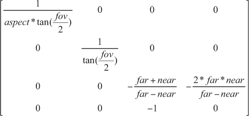

# Part 11: 3D Perspective Projection Matrix

[Back to Dev Log](../README.md)

## References

- [Metal Render Pipeline tutorial series by Rick Twohy](https://www.youtube.com/playlist?list=PLEXt1-oJUa4BVgjZt9tK2MhV_DW7PVDsg)
- [3D Perspective Projection Matrix](https://gamedev.stackexchange.com/questions/120338/what-does-a-perspective-projection-matrix-look-like-in-opengl)
- [3D Perspective Projection Matrix in Action](https://webglfundamentals.org/webgl/lessons/webgl-3d-perspective.html)
- [Projecting a Cube](https://glumpy.readthedocs.io/en/latest/tutorial/cube-ugly.html)
- [Calculating Primitive Visibility Using Depth Testing](https://developer.apple.com/documentation/metal/render_passes/calculating_primitive_visibility_using_depth_testing)

---

## Table of Content

- [3D Perspective Projection Matrix](#3d-perspective-projection-matrix)
- [Cube Mesh](#cube-mesh)
- [Depth Stencil Descriptor](#depth-stencil-descriptor)
- [Depth Stencil State](#depth-stencil-state)
- [Mesh Renderer](#mesh-renderer)
- [Camera](#camera)
- [Scene](#scene)
- [Shader](#shader)

---

## 3D Perspective Projection Matrix

Projecting 3D objects onto a flat surface means connecting each vertex to the position of the camera, and pin pointing where that line crosses the near clip plane.


[Image Source 🔗](https://glumpy.readthedocs.io/en/latest/tutorial/cube-ugly.html)

The near and far clip planes determine what gets rendered in terms of depth.

The field of view means how much stuff gets into the projection in terms of bounds vertically and horizontally.


[Image Source 🔗](https://webglfundamentals.org/webgl/lessons/webgl-3d-perspective.html)

All the calculations can be put into a pre-determined matrix that can be multiplied by a position vector and it will return the homogenous device screen position coordinates (-1,-1) to (1,1)



[Image Source 🔗](https://gamedev.stackexchange.com/questions/120338/what-does-a-perspective-projection-matrix-look-like-in-opengl)

```swift
mutating func projectPerspective(fieldOfView: Float, aspectRatio: Float, farClippingDistance: Float, nearClippingDistance: Float) {
    var result = matrix_identity_float4x4

    let fov = fieldOfView
    let aspect = aspectRatio
    let far = farClippingDistance
    let near = nearClippingDistance

    result.columns = (
        float4(Float(1) / ( aspect * tan(fov / Float(2)) ), 0, 0, 0),
        float4(0, Float(2) / tan(fov / Float(2)), 0, 0),
        float4(0, 0, -((far + near)/(far - near)), -1),
        float4(0, 0, -((2 * far * near)/(far - near)), 0)
    )

    self = matrix_multiply(self, result)
}
```

---

## Result

Pressing the keyboard arrows now moves the camera along the x and y coordinates.


