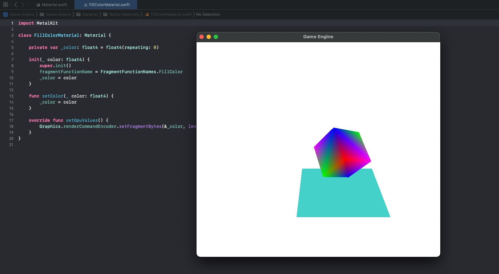

# Part 13: Materials, Multiple Render Pipeline Descriptors and States

[Back to Readme](../../README.md)

## References

- [Metal Render Pipeline tutorial series by Rick Twohy](https://www.youtube.com/playlist?list=PLEXt1-oJUa4BVgjZt9tK2MhV_DW7PVDsg)

## Table of Content

- [Material](#material)
- [MTLRenderPipelineDescriptor](#mtlrenderpipelinedescriptor)
- [Mesh Renderer](#mesh-renderer)
- [Shader](#shader)
- [Result](#result)

---

## Result

The **materials** will have references to the names of the **functions** used for the **Vertex Shader** and **Fragment Shader** stages.

```swift
class Material {
    public var vertexFunctionName: String = VertexFunctionNames.Basic
    public var fragmentFunctionName: String = FragmentFunctionNames.VertexColor

    public var renderPipelineStateId: String {
        return "\(vertexFunctionName)/\(fragmentFunctionName)"
    }

    func setGpuValues() {}
}
```

Specific **instances** of **Materials**, will also optionally have other attributes.

And also will set **values** to the **GPU** via the **Render Command Encoder**, using **.setVertexBytes** and **.setFragmentBytes**.

```swift
class FillColorMaterial: Material {

    private var _color: float4 = float4(repeating: 0)

    init(_ color: float4) {
        super.init()
        fragmentFunctionName = FragmentFunctionNames.FillColor
        _color = color
    }

    func setColor(_ color: float4) {
        _color = color
    }

    override func setGpuValues() {
        Graphics.renderCommandEncoder.setFragmentBytes(&_color, length: float4.stride, index: 1)
    }
}
```

---

## MTLRenderPipelineDescriptor

The **render pipeline descriptor** will use the functions defined in the **material**, which will be reused for any i**nstances of Mat**erials that use the same **combination** of **Vertex/Fragment shaders**.

```swift
public struct RenderPipelineDescriptor{
    ...

    init(material: Material){

        // create the descriptor for the render pipeline
        _renderPipelineDescriptor = MTLRenderPipelineDescriptor()

        ...

        _renderPipelineDescriptor.vertexFunction = VertexShaderCache.get(material.vertexFunctionName)
        _renderPipelineDescriptor.fragmentFunction = FragmentShaderCache.get(material.fragmentFunctionName)

        ...
    }
}
```

There will also be a **render pipeline state** associated to the combination of **vertex and fragment functions** used by the **material**.

```swift
public struct RenderPipelineState {
    var renderPipelineState: MTLRenderPipelineState!

    init(material: Material){
        do{
            renderPipelineState = try Engine.device.makeRenderPipelineState(descriptor: RenderPipelineDescriptorCache.get(material))
        }catch let error as NSError {
            print("ERROR::CREATE::RENDER_PIPELINE_STATE::__\(material.renderPipelineStateId)__::\(error)")
        }
    }
}
```

---

## Mesh Renderer

The mesh renderer will now configure the render command encoder to use the appropriate render pipeline state, according to the associated material.

Also, before rendering, it will execute the material function to setGpuValues()

```swift
class MeshRenderer : Component, Renderable, LateUpdatable {

    ...
    private var _material: Material!

    init(mesh: Mesh, material: Material) {
        ...

        _material = material
    }

    ...

    func doRender() {

        Graphics.renderCommandEncoder.setRenderPipelineState(RenderPipelineStateCache.get(_material))

        ...

        _material.setGpuValues()

        ...
    }
}
```

---

## Shader

The **metal shader** can now pickup the **passed in values** directly off of the **buffers**.

```c
fragment half4 fill_color_fragment_shader(
    const FragmentData IN [[ stage_in ]],
    constant float4 &color [[ buffer(1) ]]
){
    return half4(color.r, color.g, color.b, color.a);
}
```

These values were set by the material earlier:

```swift
override func setGpuValues() {
    Graphics.renderCommandEncoder.setFragmentBytes(&_color, length: float4.stride, index: 1)
}
```

---

## Result

Now the quad is using a different fragment function than the cube, because the render command encoder is using different render pipeline states.


