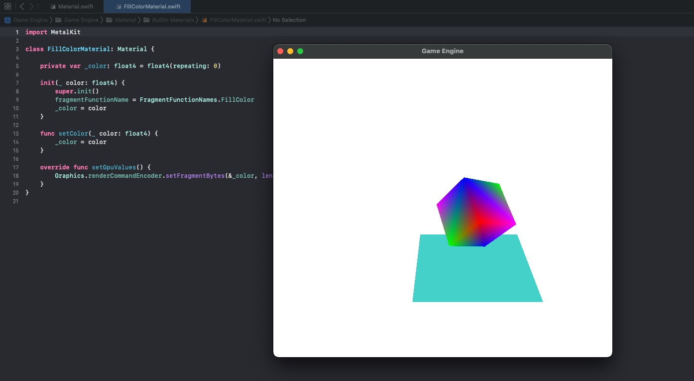
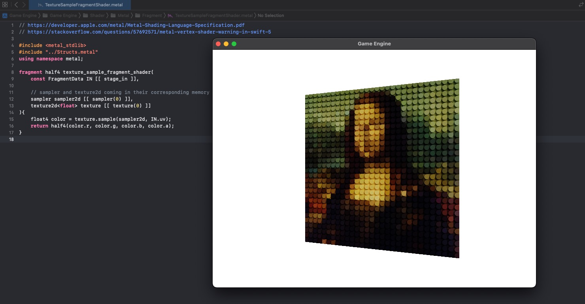

# Part 14: UVs, Loading and Sampling Textures

[Back to Readme](../../README.md)

## References

- [Metal Render Pipeline tutorial series by Rick Twohy](https://www.youtube.com/playlist?list=PLEXt1-oJUa4BVgjZt9tK2MhV_DW7PVDsg)
- [Mona Lisa Texture](https://unsplash.com/photos/cZveUvrezvY)

## Table of Content

- [Vertex)(#vertex)
- [Mesh](#mesh)
- [Basic UVs Shader](#basic-uvs-shader)
- [Texture](#texture)
- [Sampler](#sampler)
- [Material](#material)
- [Shader](#shader)
- [Result](#result)

---

## Vertex

We need to update the class that represents the **vertices** in the **mesh** by adding a new **float2** to represent the **uv coordinates**.

```swift
struct Vertex: sizeable{
    var position: float3
    var color: float4
    var uv: float2

    init(
        position: float3,
        color: float4 = float4(repeating: 0),
        uv: float2 = float2(repeating: 0)
    ) {
        self.position = position
        self.color = color
        self.uv = uv
    }
}
```

Similarly, we also need to update the **MTLVertexDescriptor**.

```swift
public struct BasicVertexDescriptor : VertexDescriptor{
    ...

    init(){
        ...

        // uv
        vertexDescriptor.attributes[2].format = MTLVertexFormat.float2
        vertexDescriptor.attributes[2].bufferIndex = 0
        vertexDescriptor.attributes[2].offset = float3.size + float4.size

        ...
    }
}
```

Finally, we also need to update the **VertexData** and **FragmentData** structs in the **GPU** side, and update the **basic_vertex_shader** to pass along the **uvs** to the fragments.

### Structs

```c
struct VertexData {
    float3 position [[ attribute(0) ]];
    float4 color [[ attribute(1) ]];
    float2 uv [[ attribute(2) ]];
};

struct FragmentData {
    // use position attribute to prevent interpolation of the value
    float4 position [[ position ]];
    float4 color;
    float2 uv;
    float time;
};
```

### Vertex Shader Function

```c
vertex FragmentData basic_vertex_shader(
  // metal can infer the data because we are describing it using the vertex descriptor
  const VertexData IN [[ stage_in ]],
  constant ModelConstants &modelConstants [[ buffer(1) ]],
  constant SceneConstants &sceneConstants [[ buffer(2) ]]
){
    FragmentData OUT;

    ...

    OUT.uv = IN.uv;

    ...

    return OUT;
}
```

---

## Mesh

We update the Quad mesh to have uv coordinates.

```swift
class QuadMesh : Mesh{
    override func createMesh() {
        vertices = [
            Vertex(position: float3( 0.5, 0.5,0), uv: float2(1,0)), //Top Right
            Vertex(position: float3(-0.5, 0.5,0), uv: float2(0,0)), //Top Left
            Vertex(position: float3(-0.5,-0.5,0), uv: float2(0,1)), //Bottom Left
            Vertex(position: float3( 0.5,-0.5,0), uv: float2(1,1))  //Bottom Right
        ]

        indices = [
            0,1,2,
            0,2,3
        ]
    }
}
```

---

## Basic UVs Shader

Right now we can define a **simple fragment shader** to display the **uv coordinates** **colors**, and also animate it using the **global game time**.

```c
fragment half4 uvs_fragment_shader(
    const FragmentData IN [[ stage_in ]]
){
    return half4(
        sin(IN.uv.x + IN.time),
        sin(IN.uv.y + IN.time),
        0,
        1
    );
}
```

### UVs Gradient



---

## Texture

We will create a cache to store built in textures, using **MTLTexture** and **MTKTextureLoader**.

```swift
class TextureLoader {
    private var _name: String!
    private var _fileExtension: String!
    private var _origin: MTKTextureLoader.Origin

    ...

    public func load()->MTLTexture {
        var result: MTLTexture!

        if let url = Bundle.main.url(forResource: _name, withExtension: _fileExtension) {

            let loader = MTKTextureLoader(device: Engine.device)
            let options: [MTKTextureLoader.Option: Any] = [MTKTextureLoader.Option.origin : _origin]

            do {
                result = try loader.newTexture(URL: url, options: options)
                result.label = _name
        ...

        return result
    }
}
```

---

## Sampler

Similarly, we will keep a cache of **MTLSamplerState** to use when sampling the textures.

**Linear** means the **algorithm** that will be use when sampling textures, when the object is **minified** or **magnified** on screen.

```swift
class LinearSamplerState : SamplerState {

    override init() {
        super.init()

        let samplerDescriptor = MTLSamplerDescriptor()

        samplerDescriptor.minFilter = .linear
        samplerDescriptor.magFilter = .linear

        samplerState = Engine.device.makeSamplerState(descriptor: samplerDescriptor)
    }
}
```

---

## Material

The **material** will be in charge of passing the **Texture** and the **SamplerState** to the **GPU** before rendering.

```swift
class TextureSampleMaterial: Material {

    private var _textureType: BuiltInTexture!

    init(_ textureType: BuiltInTexture) {
        super.init()
        fragmentFunctionName = FragmentFunctionNames.TextureSample
        setTextureType(textureType)
    }

    func setTextureType(_ textureType: BuiltInTexture) {
        _textureType = textureType
    }

    override func setGpuValues() {
        Graphics.renderCommandEncoder.setFragmentSamplerState(SamplerStateCache.get(.Linear), index: 0)
        Graphics.renderCommandEncoder.setFragmentTexture(TextureCache.get(_textureType), index: 0)
    }
}
```

The **Game Object** initializes the **MeshRenderer** with the corresponding **Material** and **Texture**.

```swift
let mesh = MeshCache.get(.Quad)
let material = TextureSampleMaterial(.MonaLisa)

self.addComponent(MeshRenderer(mesh: mesh, material: material))
```

---

## Shader

In the **Metal Shader** code, we will access the **Texture** and **SamplerState** from the corresponding **blocks of memory**.

**sampler(0)** and **texture(0)** mean that we will access the desired elements at the specified indexes.

```c
fragment half4 texture_sample_fragment_shader(
    const FragmentData IN [[ stage_in ]],

    // sampler and texture2d coming in their corresponding memory blocks
    sampler sampler2d [[ sampler(0) ]],
    texture2d<float> texture [[ texture(0) ]]
){
    float4 color = texture.sample(sampler2d, IN.uv);
    return half4(color.r, color.g, color.b, color.a);
}
```

---

## Result

The Quad now renders the texture using the UV texture coordinates.


