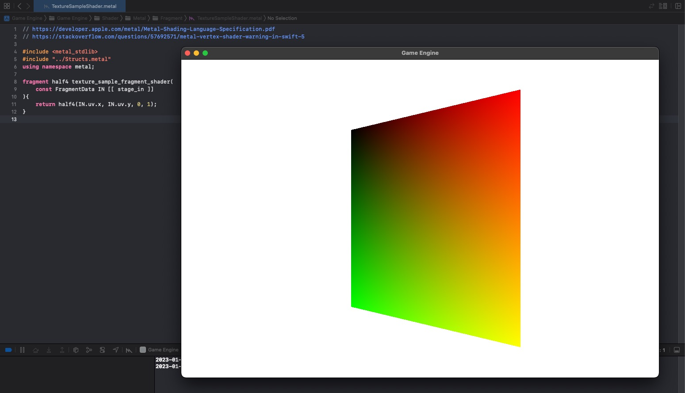

# Part 13: UVs and Textures

[Back to Readme](../../README.md)

## References

- [Metal Render Pipeline tutorial series by Rick Twohy](https://www.youtube.com/playlist?list=PLEXt1-oJUa4BVgjZt9tK2MhV_DW7PVDsg)
- [Mona Lisa Texture](https://unsplash.com/photos/cZveUvrezvY)

## Table of Content

- [Vertex](#vertex)
- [Mesh](#mesh)
- [Result](#result)

---

## Result

The Quad now renders the texture using the UV texture coordinates.

