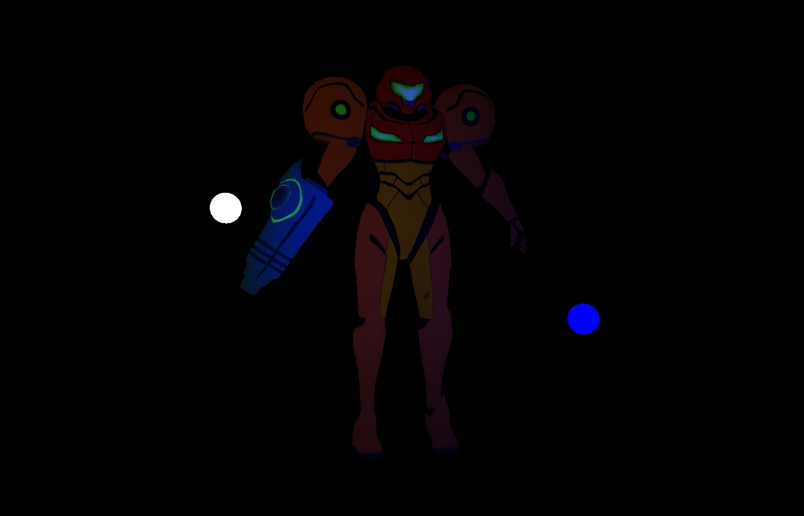

# Part 16: Lighting, Ambient, Diffuse and Specular

[Back to Readme](../../README.md)

## References

- [Metal Render Pipeline tutorial series by Rick Twohy](https://www.youtube.com/playlist?list=PLEXt1-oJUa4BVgjZt9tK2MhV_DW7PVDsg)
- [MSL: const, constant and device](https://stackoverflow.com/questions/59010429/what-the-purpose-of-declaring-a-variable-with-const-constant)
- [C arrays behave as pointers](https://stackoverflow.com/questions/2094666/pointers-in-c-when-to-use-the-ampersand-and-the-asterisk)
- [C Pointers](https://www.programiz.com/c-programming/c-pointers)

## Table of Content

- [Model Mesh Reference](#model-mesh-reference)
- [Model Mesh Loader](#model-mesh-loader)
- [Mesh](#mesh)
- [Mesh Renderer](#mesh-renderer)
- [Textures](#textures)
- [Model Game Object](#model-game-object)
- [Result](#result)

---

## Model Mesh Reference

The **Model Mesh Reference** will point to the asset that we want to load from.

It will also have a **load()** method that will be in charge of initializing the actual **Mesh** object.

```swift
protocol MeshReference {
    var id: String! { get }
    func load()->Mesh
}

class ModelMeshReference : MeshReference {
    public var name: String!
    public var fileExtension: String! = "obj"
    public var meshIndex: Int = 0

    public var id: String! {
        return "\(name!).\(fileExtension!):\(meshIndex)"
    }

    init(
        _ name: String,
        fileExtension: String = "obj",
        meshIndex: Int = 0
    ){
        self.name = name
        self.fileExtension = fileExtension
        self.meshIndex = meshIndex
    }

    func load()->Mesh {
        return ModelMeshLoader(self).load()
    }
}
```

This will act as an **identifier** when caching model meshes in the corresponding cache.

```swift
    public var id: String! {
        return "\(name!).\(fileExtension!):\(meshIndex)"
    }
```

```swift
class MeshCache : Cache<MeshReference, Mesh> {

    private static var _meshes: [String: Mesh] = [:]

    override class func get(_ meshReference: MeshReference)->Mesh{

        if(!_meshes.keys.contains(meshReference.id)) {
            _meshes.updateValue(meshReference.load(), forKey: meshReference.id)
        }

        return _meshes[meshReference.id]!
    }
}
```

---

## Model Mesh Loader

Will be in charge of actually using **ModelIO** to load the data for the **vertices** from the **.obj** file.

It will **initialize** a **vertex descriptor** off of our **metal BasicVertexDescriptor**.

Since **.obj** files can contain **multiple meshes** inside, we will also just return the one specified in the **mesh reference**.

```swift
class ModelMeshLoader {
    private var _meshReference: ModelMeshReference!

    init(_ meshReference: ModelMeshReference) {
        _meshReference = meshReference
    }

    public func load()->Mesh {
        guard let url = Bundle.main.url(forResource: _meshReference.name, withExtension: _meshReference.fileExtension) else {
            fatalError("ERROR::LOADING::MODEL::__\(_meshReference.name!).\(_meshReference.fileExtension!)__::does not exist")
        }

        let vertexDescriptor = MTKModelIOVertexDescriptorFromMetal(VertexDescriptorCache.get(.Basic))

        // make each attribute mapped to each attribute type
        (vertexDescriptor.attributes[0] as! MDLVertexAttribute).name = MDLVertexAttributePosition
        (vertexDescriptor.attributes[1] as! MDLVertexAttribute).name = MDLVertexAttributeNormal
        (vertexDescriptor.attributes[2] as! MDLVertexAttribute).name = MDLVertexAttributeColor
        (vertexDescriptor.attributes[3] as! MDLVertexAttribute).name = MDLVertexAttributeTextureCoordinate

        let bufferAllocator = MTKMeshBufferAllocator(device: Engine.device)
        let asset: MDLAsset = MDLAsset(
            url: url,
            vertexDescriptor: vertexDescriptor,
            bufferAllocator: bufferAllocator
        )

        var meshes: [Any]! = []
        do {
            meshes = try MTKMesh.newMeshes(asset: asset, device: Engine.device).metalKitMeshes
        } catch {
            print("ERROR::LOADING::MODEL::__\(_meshReference.name!).\(_meshReference.fileExtension!)__::\(error)")
        }

        return ModelMesh(loadedMesh: meshes[_meshReference.meshIndex])
    }
}
```

---

## Mesh

**Meshes** now differentiate, **BuiltIn Meshes** have just a **vertex buffer** and an **index buffer**.

**Model Meshes** have a **MTKMesh** inside, that will grant access to the different vertex and index buffers.

```swift
class Mesh {}

class BuiltInMesh : Mesh {
    public var vertices: [Vertex]! = []
    public var indices: [UInt32]! = []

    public var vertexBuffer: MTLBuffer!
    public var indexBuffer: MTLBuffer!

    override init() {
        super.init()
        createMesh()

        vertexBuffer = Engine.device.makeBuffer(bytes: vertices, length: Vertex.stride * vertices.count, options: [])

        if(indices.count > 0){
            indexBuffer = Engine.device.makeBuffer(bytes: indices, length: UInt32.stride * indices.count, options: [])
        }
    }

    func createMesh() {}
}

class ModelMesh : Mesh {
    public var mtkMesh: MTKMesh? = nil

    init(loadedMesh: Any) {
        super.init()

        if let metalKitMesh = loadedMesh as? MTKMesh {
            self.mtkMesh = metalKitMesh
        }
    }
}
```

---

## Mesh Renderer

The **Mesh Renderer** will decide how to render the mesh, depending on if it's a **built in mesh**, or a **model mesh**.

```swift
func doRender() {

    Graphics.renderCommandEncoder.setRenderPipelineState(RenderPipelineStateCache.get(_material))

    // Vertex Shader data
    Graphics.renderCommandEncoder.setVertexBytes(&_modelConstants, length: ModelConstants.stride, index: 1) // model matrix

    _material.setGpuValues()

    Graphics.renderCommandEncoder.setDepthStencilState(DepthStencilStateCache.get(.Less))

    let mesh = MeshCache.get(_meshReference)

    if let builtInMesh = mesh as? BuiltInMesh {
        renderBuiltInMesh(builtInMesh)
    } else if let modelMesh = mesh as? ModelMesh {
        renderModelMesh(modelMesh)
    }
}

func renderBuiltInMesh(_ mesh: BuiltInMesh) {
    Graphics.renderCommandEncoder.setVertexBuffer(mesh.vertexBuffer, offset: 0, index: 0)

    if(mesh.indices.count > 0){
        Graphics.renderCommandEncoder.drawIndexedPrimitives(
            type: MTLPrimitiveType.triangle,
            indexCount: mesh.indices.count,
            indexType: MTLIndexType.uint32,
            indexBuffer: mesh.indexBuffer,
            indexBufferOffset: 0,
            instanceCount: 1 // for now, might change in the future
        )
    } else {
        Graphics.renderCommandEncoder.drawPrimitives(
            type: MTLPrimitiveType.triangle,
            vertexStart: 0,
            vertexCount: mesh.vertices.count
        )
    }
}

func renderModelMesh(_ mesh: ModelMesh) {

    if(mesh.mtkMesh == nil) { return }

    for vertexBuffer in mesh.mtkMesh!.vertexBuffers {
        Graphics.renderCommandEncoder.setVertexBuffer(vertexBuffer.buffer, offset: vertexBuffer.offset, index: 0)

        for submesh in mesh.mtkMesh!.submeshes {
            Graphics.renderCommandEncoder.drawIndexedPrimitives(
                type: submesh.primitiveType,
                indexCount: submesh.indexCount,
                indexType: submesh.indexType,
                indexBuffer: submesh.indexBuffer.buffer,
                indexBufferOffset: submesh.indexBuffer.offset,
                instanceCount: 1 // for now, might change in the future
            )
        }
    }
}
```

---

## Textures

Similar to how we handle meshes, **Textures** will have a **Texture Reference** that will act as an id in the **Texture Cache**.

```swift
class TextureReference {
    public var name: String!
    public var fileExtension: String! = "jpg"
    public var textureLoaderOrigin: MTKTextureLoader.Origin! = MTKTextureLoader.Origin.topLeft

    public var id: String! {
        return "\(name!).\(fileExtension!):\(textureLoaderOrigin!)"
    }

    init(
        _ name: String,
        fileExtension: String = "jpg",
        textureLoaderOrigin: MTKTextureLoader.Origin = MTKTextureLoader.Origin.topLeft
    ){
        self.name = name
        self.fileExtension = fileExtension
        self.textureLoaderOrigin = textureLoaderOrigin
    }

    func load()->MTLTexture {
        return TextureLoader(self).load()
    }
}
```

And the **Texture Reference** will use the **Texture Loader** to load the corresponding **MTLTexture**.

```swift
class TextureLoader {
    private var _textureReference: TextureReference!

    init(_ textureReference: TextureReference) {
        _textureReference = textureReference
    }

    public func load()->MTLTexture {
        var result: MTLTexture!

        guard let url = Bundle.main.url(forResource: _textureReference.name, withExtension: _textureReference.fileExtension) else {
            fatalError("ERROR::LOADING::TEXTURE::__\(_textureReference.name!).\(_textureReference.fileExtension!)__::does not exist")
        }

        let loader = MTKTextureLoader(device: Engine.device)
        let options: [MTKTextureLoader.Option: Any] = [MTKTextureLoader.Option.origin : _textureReference.textureLoaderOrigin!]

        do {
            result = try loader.newTexture(URL: url, options: options)
            result.label = _textureReference.name
        } catch let error as NSError {
            print("ERROR::LOADING::TEXTURE::__\(_textureReference.name!).\(_textureReference.fileExtension!)__::\(error)")
        }

        return result
    }
}
```

This will allow us to load any texture asset, without needing an enumerator.

```swift
class TextureCache : Cache<TextureReference, MTLTexture> {

    private static var _textures: [String: MTLTexture] = [:]

    override class func get(_ textureReference: TextureReference)->MTLTexture{

        if(!_textures.keys.contains(textureReference.id)) {
            _textures.updateValue(textureReference.load(), forKey: textureReference.id)
        }

        return _textures[textureReference.id]!
    }
}
```

---

## Model Game Object

Will take in a **Mesh Reference** and a **Texture Reference**.

Internally it will add a **Mesh Renderer** using the **mesh reference**, and also will set the **Material** to **sample the texture** using the **texture coordinates**.

```swift
class ModelGameObject : GameObject {

    init(
        modelMeshReference: ModelMeshReference,
        textureReference: TextureReference
    ) {
        super.init()

        let material = TextureSampleMaterial(textureReference)

        self.addComponent(MeshRenderer(meshReference: modelMeshReference, material: material))
        self.addComponent(RotateYComponent())
    }
}
```

To set up the **scene** that uses our **Samus.obj** file, we need to do:

```swift
let samusGameObject = ModelGameObject(
    modelMeshReference: ModelMeshReference("samus"),
    textureReference: TextureReference("samus", fileExtension: "png", textureLoaderOrigin: MTKTextureLoader.Origin.bottomLeft)
)
```

---

## Result

The screen now shows the **3D model of Samus**, with its **base texture** correctly sampled.


