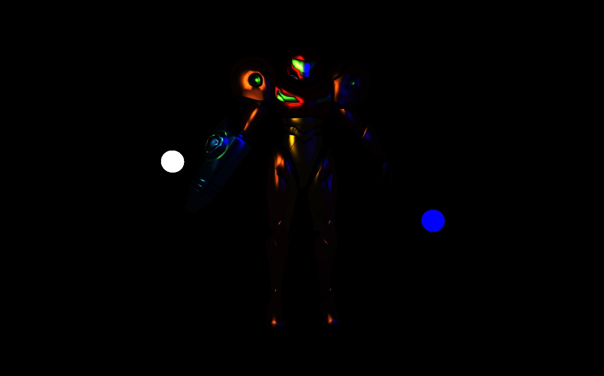

# Part 16: Lighting, Ambient, Diffuse and Specular

[Back to Readme](../../README.md)

## References

- [Metal Render Pipeline tutorial series by Rick Twohy](https://www.youtube.com/playlist?list=PLEXt1-oJUa4BVgjZt9tK2MhV_DW7PVDsg)
- [MSL: const, constant and device](https://stackoverflow.com/questions/59010429/what-the-purpose-of-declaring-a-variable-with-const-constant)
- [C arrays behave as pointers](https://stackoverflow.com/questions/2094666/pointers-in-c-when-to-use-the-ampersand-and-the-asterisk)
- [C Pointers](https://www.programiz.com/c-programming/c-pointers)

## Table of Content

- [Light Component](#light-component)
- [Light Data](#light-data)
- [Light Manager](#light-manager)
- [Scene](#scene)
- [Material](#material)
- [Material Data](#material-data)
- [Lit Shader](#lit-shader)
  - [Attenuation](#attenuation)
  - [Ambient](#ambient)
  - [Diffuse](#diffuse)
  - [Specular](#specular)
- [Result](#result)

---

## Light Component

Will be in charge of keeping the **position** of the **light**, by reusing the **transform object**.
Also generates the **Light Data** whenever requested.

```swift
enum LightType {
    case Point
    case Directional
}

class Light : Component {

    public var type: LightType = LightType.Point

    public var intensity: Float = 1
    public var ambient: Float = 0.3
    public var color: float4 = Colors.White

    public var range: Float = 0.6

    private var _data: LightData = LightData()
    public var data: LightData! {

        _data.position = gameObject.position
        _data.color = color
        _data.intensity = intensity
        _data.ambient = ambient
        _data.range = range

        return _data
    }
}
```

---

## Light Data

Is just a **struct** that can be passed down to the **GPU** with the relevant **Light information**.

```swift
struct LightData: sizeable {
    var position: float3 = float3(repeating: 0)
    var color: float4 = Colors.White
    var intensity: Float = 1
    var ambient: Float = 0.3
    var range: Float = 0.6
}
```

The **GPU** will also define a struct to access the data from the **buffer**.

```c
struct LightData {
    float3 position;
    float4 color;
    float intensity;
    float ambient;
    float range;
};
```

---

## Light Manager

Each time a **light component** is added to a **game object**, the **light manager** keeps track of it.

```swift
class GameObject : Transform {
    private var _components: [Component]! = []

    public func addComponent(_ component: Component){
        _components.append(component)
        component.setGameObject(self)

        // set the camera as the main camera
        if let camera  = component as? Camera {
            CameraManager.mainCamera = camera
        }

        // keep track of the lights
        if let light  = component as? Light {
            LightManager.addLight(light)
        }
    }
}
```

The **Light Manager** is in charge of generating the **buffer** with all the **Light Data**.

It's very inefficient to do this on each cycle, but for siplicity we will keep it like this for now.

```swift
class LightManager {
    public static var lightsBuffer: MTLBuffer? {
        if(_lights.count == 0) { return nil }

        _lightDatas = []
        for light in _lights {
            _lightDatas.append(light.data)
        }

        // ineficcient, but will do for now
        // we need an updated position of the lights
        return Engine.device.makeBuffer(bytes: _lightDatas, length: LightData.stride * _lightDatas.count , options: [])
    }

    public static var lightsCount: Int! {
        return _lights.count
    }

    private static var _lightDatas: [LightData]! = []
    private static var _lights: [Light]! = []
    private static var _lightsBuffer: MTLBuffer!

    static func addLight(_ light: Light) {
        _lights.append(light)
    }
}
```

---

## Scene

Now also sets the **Light Data** buffer whenever there are lights on the **scene**.

```swift
override func render() {

    updateSceneConstants()

    // set the view matrix and projection matrix
    Graphics.renderCommandEncoder.setVertexBytes(&_sceneConstants, length: SceneConstants.stride, index: 2)

    // set light data
    if LightManager.lightsCount > 0 {
        var lightsCount = LightManager.lightsCount
        Graphics.renderCommandEncoder.setFragmentBuffer(LightManager.lightsBuffer, offset: 0, index: 1)
        Graphics.renderCommandEncoder.setFragmentBytes(&lightsCount, length: Int32.stride, index: 2)
    }

    super.render()
}
```

---

## Material

Materials now also have some common **surface properties**, like **color** and **glossiness**.
In the future they can also have **standard surface properties** like **emission**, **metallic**, **albedo**, **normal maps**, etc.

By default, **Materials** set their **values** to the **GPU** in the **fragment buffer 0**.

```swift
class Material {
    public var materialData: MaterialData = MaterialData()

    public var vertexFunctionName: String = VertexFunctionNames.Basic
    public var fragmentFunctionName: String = FragmentFunctionNames.VertexColor

    public var renderPipelineStateId: String {
        return "\(vertexFunctionName)/\(fragmentFunctionName)"
    }

    func setColor(_ color: float4){
        materialData.color = color
    }

    func setGlossiness(_ glossiness: Float){
        materialData.glossiness = glossiness
    }

    func setGpuValues() {
        Graphics.renderCommandEncoder.setFragmentBytes(&materialData, length: MaterialData.stride, index: 0)
    }
}
```

---

## Material Data

Is just a **struct** that can be passed down to the **GPU** with the relevant **Material values**.

```swift
struct MaterialData: sizeable {
    public var color: float4 = Colors.White
    public var glossiness: Float = 2
}
```

The **GPU** will also define a struct to access the data from the **buffer**.

```c
struct MaterialData {
    float4 color;
    float glossiness;
};
```

---

## Lit Shader

The **general structure** of the **lit shader** that **samples textures** will be like below.
It takes in the **material properties** to access the **glossiness** for the **specular calculation**.
The **lights** will come in an array, each with their poisition and other relevant data.

The **fragment shader** will also have access to **the camera position**, and the **normals** of the fragments.

```c
fragment half4 lit_texture_sample_fragment_shader(
    const FragmentData IN [[ stage_in ]],

    constant MaterialData & materialData [[ buffer(0) ]],

    constant LightData * lights [[ buffer(1) ]],
    constant int & lightsCount [[ buffer(2) ]],

    // sampler and texture2d coming in their corresponding memory blocks
    sampler sampler2d [[ sampler(0) ]],
    texture2d<float> texture [[ texture(0) ]]
){
    // sample texture
    float4 color = texture.sample(sampler2d, IN.uv);

    for(int i = 0; i < lightsCount; i++){
        LightData light = lights[i];

        // TODO: CALCULATE PHONG LIGHTING
    }

    float4 phong = totalAmbient + totalDiffuse + totalSpecular;
    color = color * phong;

    return half4(color.r, color.g, color.b, color.a);
}
```

### Attenuation

We calculate a **linear attenuation** to make the light **intensity fade away** the farther away we are from the light, given a **range**.

```c
LightData light = lights[i];

// light direction
float4 lightDir = float4(light.position.xyz, 1) - IN.worldPosition;

// attenuation
float distanceToLight = length(lightDir);
float attenuation = 1 - clamp(distanceToLight/light.range, 0.0, 1.0);
```

### Ambient

The **ambient** is calculated using the **ambient intensity** of the **light**, its **color** and the **attenuation**.

```c
// ambient
float4 ambient = light.color * light.ambient * attenuation;
```


### Diffuse

The **diffuse** is calculated by doing the **DOT product** between the **surface normal** and the **light direction** vector.
The more the **surface** is to a **90 degree to the light direction**, or past it **facing away from the light**, the **darker** it's going to be.

```c
// diffuse
float nDotL = max(dot(normalize(IN.worldNormal), normalize(lightDir)), 0.0);
float4 diffuse =  light.color * nDotL * light.intensity * attenuation;
```


### Specular

The **specular** is calculated by **reflecting** the **light direction** by the **surface normal vector**.
Then doing the **DOT product** between the **reflected light direction** and the **view direction**.

The more the rays are pointing to the camera, the brighter.

Finally we do a **power** by the **glossiness** defined in the **material**, the more glossiness, the **sharper** the **reflections** will be.

```c
// specular
float3 viewDir = IN.cameraPosition - IN.worldPosition.xyz;
float3 reflectedLightDir = reflect(-normalize(lightDir.xyz), normalize(IN.worldNormal.xyz));
float vDotL = max(0.0, dot(reflectedLightDir, normalize(viewDir))); // avoid negative values
vDotL = pow(vDotL, materialData.glossiness);
float4 specular =  light.color * vDotL * light.intensity * attenuation;
```



---

## Result

The **3D model of Samus** is now correclty illuminated with **ambient**, **diffuse** and **specular** components.


