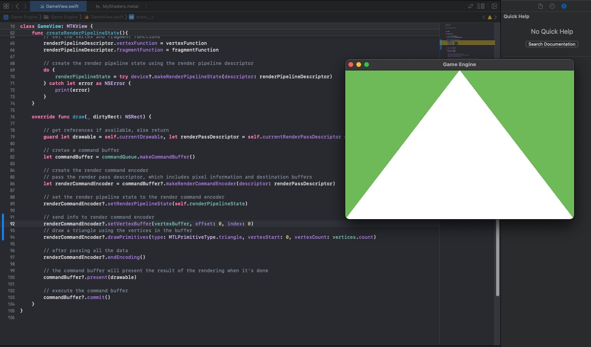

# Part 2: Draw a simple Triangle in the Screen

[Back to Readme](../../README.md)

## References

- [Metal Render Pipeline tutorial series by Rick Twohy](https://www.youtube.com/playlist?list=PLEXt1-oJUa4BVgjZt9tK2MhV_DW7PVDsg)
- [Metal Shading Language Specification](https://developer.apple.com/metal/Metal-Shading-Language-Specification.pdf)

---

## Table of Content

- [Vertex Buffer](#vertex-buffer)
- [Vertex Shader](#vertex-shader)
- [Draw Primitives](#draw-primitives)
- [Result](#result)

---

## Vertex Buffer

[Rendering Primitives](https://developer.apple.com/documentation/metal/using_a_render_pipeline_to_render_primitives)
[MTL Buffer](https://developer.apple.com/documentation/metal/mtlbuffer)

Define an array of vectors representing the vertices we want to draw in the screen.

```swift
// counter clock wise to define the face
var vertices: [float3] = [
    float3(0, 1, 0),    // top mid
    float3(-1, -1, 0),  // bot left
    float3(1, -1, 0),   // top right
]
```

Declare the **memory buffer** which will be used to hold the vertices information in the **GPU**.

```swift
var vertexBuffer: MTLBuffer!;
```

Initialize the **buffer** by creating it off of the **device** reference.

The **content** is going to be the **vertices array**, the **total memory amount** is going to be the **stride** of an individual vertex times the amount of vertices.

```swift
func createBuffers() {
    let vertexMemSize = MemoryLayout<float3>.stride

    vertexBuffer = device?.makeBuffer(bytes: vertices, length: vertexMemSize * vertices.count, options: [])
}
```

---

## Vertex Shader

[Using attributes for arguments](https://metalbyexample.com/vertex-descriptors/)
[Metal-Shading-Language-Specification](https://developer.apple.com/metal/Metal-Shading-Language-Specification.pdf)

We need to lookup vertex data in the buffer manually, by using the attribute `[[buffer(0)]]`.

The attribute `[[vertex_id]]` allows us to get the vertex index in the buffer.

```c
vertex float4 basic_vertex_shader(
  device float3 *vertices [[ buffer(0) ]], // access the vertices buffer at buffer with index 0
  uint vertexID [[ vertex_id ]] // get the vertex id, which corresponds to the index of the vertex in the buffer
){
    return float4(vertices[vertexID], 1); // return the vertex position in homogeneous screen space
}
```

---

## Draw Primitives

[MTL PrimitiveType](https://developer.apple.com/documentation/metal/mtlprimitivetype)

We **set the buffer** to the **encoder**, so that the **GPU** can use it when executing the **vertex function**.

Drawing the primitives needs a **specific primitive type**, **where we start** to consider vertices, and **how many vertices** we will draw.

```swift
// send info to render command encoder
renderCommandEncoder?.setVertexBuffer(vertexBuffer, offset: 0, index: 0)
// draw a triangle using the vertices in the buffer
renderCommandEncoder?.drawPrimitives(type: MTLPrimitiveType.triangle, vertexStart: 0, vertexCount: vertices.count)
```

---

## Result


