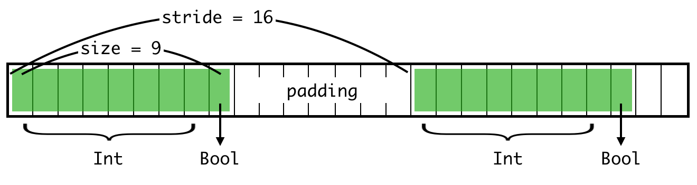
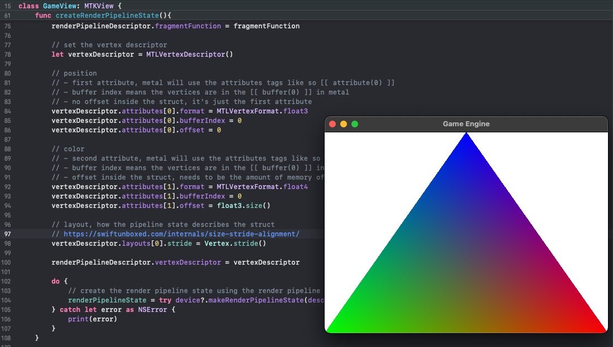

# Part 4: Vertex Descriptors

[Back to Readme](../../README.md)

## References

- [Metal Render Pipeline tutorial series by Rick Twohy](https://www.youtube.com/playlist?list=PLEXt1-oJUa4BVgjZt9tK2MhV_DW7PVDsg)
- [Size vs Stride in Swift](https://swiftunboxed.com/internals/size-stride-alignment/)

---

## Table of Content

- [Vertex Descriptor](#vertex-descriptor)
- [Vertex Shader](#vertex-shader)
- [Result](#result)

---

## Vertex Descriptor

- [MTLVertexDescriptor](https://developer.apple.com/documentation/metal/mtlvertexdescriptor)
- [MTLVertexAttributeDescriptor](https://developer.apple.com/documentation/metal/mtlvertexattributedescriptor)

Create a **MTL Vertex Descriptor** and start defining the **attributes**.

This will allow the shader to just grab the individual vertex off of the vertex buffer, without needing to access the whole vertices array and extracting the vertex with the vertex id.

```swift
// set the vertex descriptor
let vertexDescriptor = MTLVertexDescriptor()

// position
// - first attribute, metal will use the attributes tags like so [[ attribute(0) ]]
// - buffer index means the vertices are in the [[ buffer(0) ]] in metal
// - no offset inside the struct, it's just the first attribute
vertexDescriptor.attributes[0].format = MTLVertexFormat.float3
vertexDescriptor.attributes[0].bufferIndex = 0
vertexDescriptor.attributes[0].offset = 0

// color
// - second attribute, metal will use the attributes tags like so [[ attribute(1) ]]
// - buffer index means the vertices are in the [[ buffer(0) ]] in metal
// - offset inside the struct, needs to be the amount of memory of the position, in bytes
vertexDescriptor.attributes[1].format = MTLVertexFormat.float4
vertexDescriptor.attributes[1].bufferIndex = 0
vertexDescriptor.attributes[1].offset = float3.size()

// layout, how the pipeline state describes the struct
// https://swiftunboxed.com/internals/size-stride-alignment/
vertexDescriptor.layouts[0].stride = Vertex.stride()

renderPipelineDescriptor.vertexDescriptor = vertexDescriptor
```

### Size vs Stride

The Stride will always be greater than or equal to the size.

It can be greater sometimes to favor memory alignment.



[Image Source 🔗](https://swiftunboxed.com/internals/size-stride-alignment/)

---

## Vertex Shader

The struct for the Vertex Data now needs to describe the attributes using the indexes that correspond to the vertex descriptor attributes, with `[[ attribute(n) ]]`.

```c
struct VertexData {
    float3 position [[ attribute(0) ]];
    float4 color [[ attribute(1) ]];
};
```

The Vertex Shader can now just take in the corresponding Vertex Data struct using `[[ stage_in ]]`, because the GPU now has a description of the elements.

```c
vertex FragmentData basic_vertex_shader(
  // metal can infer the data because we are describing it using the vertex descriptor
  const VertexData IN [[ stage_in ]]
){
    FragmentData OUT;

    // return the vertex position in homogeneous screen space
    OUT.position = float4(IN.position, 1);
    OUT.color = IN.color;

    return OUT;
}
```

---

## Result

The end result hasn't changed.


