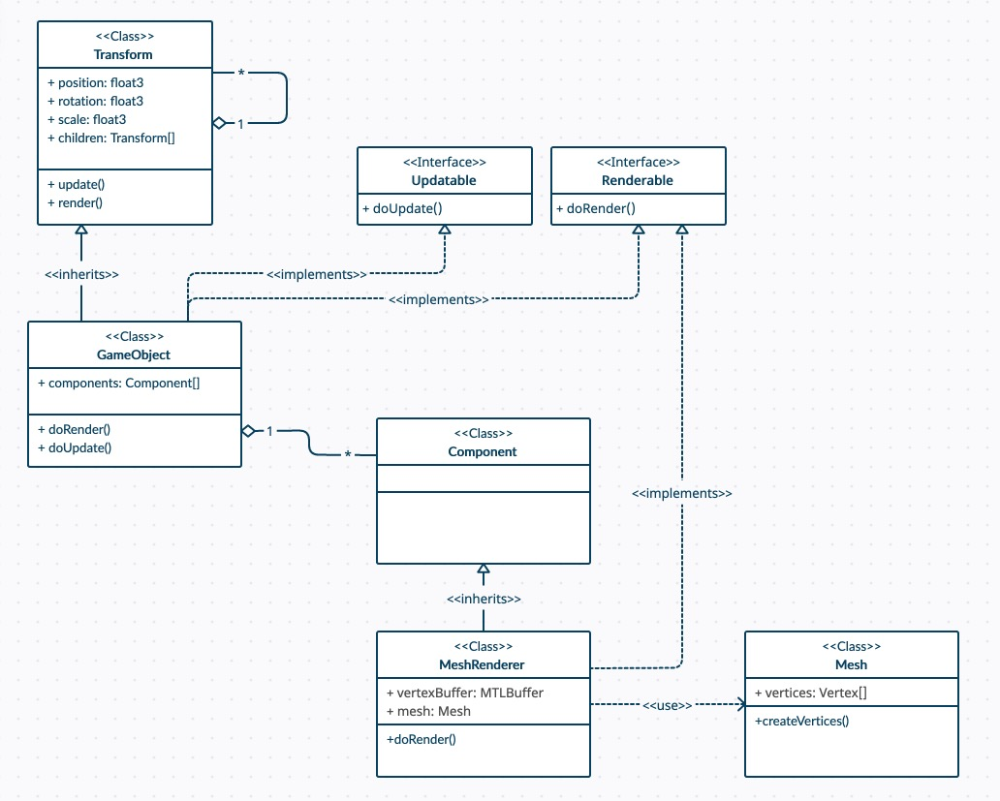

# Part 6: Transform, Components, MeshRenderer

[Back to Dev Log](../README.md)

## References

- [Metal Render Pipeline tutorial series by Rick Twohy](https://www.youtube.com/playlist?list=PLEXt1-oJUa4BVgjZt9tK2MhV_DW7PVDsg)

---

## Table of Content

- [Transform](#transform)
- [Component](#component)
- [MeshRenderer](#meshrenderer)

---

## Transform



The **Transform** class will have information about **position**, **rotation** and **scale**.

It will also have a **list of children Transform objects**, to makeup the **Scene Graph** in the **Scene**.

Everytime **render()** and **update()** are invoked on a Transform, it will iterate the children elements and invoke **render()** and **update()** on them.

Then it will check if **itself** implements the **Renderable** or **Updatable** protocols, if yes, then it will proceed to invoke **doRender()** and **doUpdate()** on itself.

```swift
class Transform {
    public var children: [Transform]! = []
    
    public func addChildren(transform: Transform){
        children.append(transform)
    }
    
    public func update(deltaTime: Float){
        for child in children {
            child.update(deltaTime: deltaTime)
        }
        
        if let updatableSelf = self as? Updatable {
            updatableSelf.doUpdate(deltaTime: deltaTime)
        }
    }
    
    public func render(renderCommandEncoder: MTLRenderCommandEncoder){
        for child in children {
            child.render(renderCommandEncoder: renderCommandEncoder)
        }
        
        if let renderableSelf = self as? Renderable {
            renderableSelf.doRender(renderCommandEncoder: renderCommandEncoder)
        }
    }
}
```

---

## Component

**GameObject** will have a list of **components** that may or may not be **Renderable** or **Updatable**.

On **doRender()** and **doUpdate()**, the **GameObject** will iterate its components and invoke **doRender()** and **doUpdate()** accordingly.

```swift
class GameObject : Transform {
    
    public var components: [Component]! = []
    
    public func addComponent(component: Component){
        components.append(component)
    }
}

extension GameObject : Updatable {
    public func doUpdate(deltaTime: Float){
        for component in components {
            if let updatableComponent = component as? Updatable {
                updatableComponent.doUpdate(deltaTime: deltaTime)
            }
        }
    }
}

extension GameObject : Renderable {
    public func doRender(renderCommandEncoder: MTLRenderCommandEncoder){
        for component in components {
            if let renderableComponent = component as? Renderable {
                renderableComponent.doRender(renderCommandEncoder: renderCommandEncoder)
            }
        }
    }
}
```

---

## MeshRenderer

The **MeshRenderer** component will be in charge of drawing the mesh using the **Metal** graphics API elements, like the render command encoder.

It will have a reference to a **Mesh** class.

```swift
class MeshRenderer : Component, Renderable {
    private var _vertexBuffer: MTLBuffer!
    private var _mesh: Mesh!
    
    init(mesh: Mesh) {
        _mesh = mesh
        _vertexBuffer = Engine.device.makeBuffer(bytes: _mesh.vertices, length: Vertex.stride * _mesh.vertices.count, options: [])
    }
    
    func doRender(renderCommandEncoder: MTLRenderCommandEncoder) {
        renderCommandEncoder.setRenderPipelineState(RenderPipelineStateCache.getPipelineState(.Basic))
        renderCommandEncoder.setVertexBuffer(_vertexBuffer, offset: 0, index: 0)
        renderCommandEncoder.drawPrimitives(type: MTLPrimitiveType.triangle, vertexStart: 0, vertexCount: _mesh.vertices.count)
    }
}
```

The **Mesh** class will have the **array of vertices** that will later be used by the **MeshRenderer** to create the **Vertex Buffer** off of.

```swift
class Mesh {
    public var vertices: [Vertex]!
    
    init(){
        createVertices()
    }
    
    func createVertices() {}
}

class TriangleMesh : Mesh{
    override func createVertices() {
        vertices = [
            Vertex(position: float3( 0, 1,0), color: float4(1,0,0,1)),
            Vertex(position: float3(-1,-1,0), color: float4(0,1,0,1)),
            Vertex(position: float3( 1,-1,0), color: float4(0,0,1,1))
        ]
    }
}
```