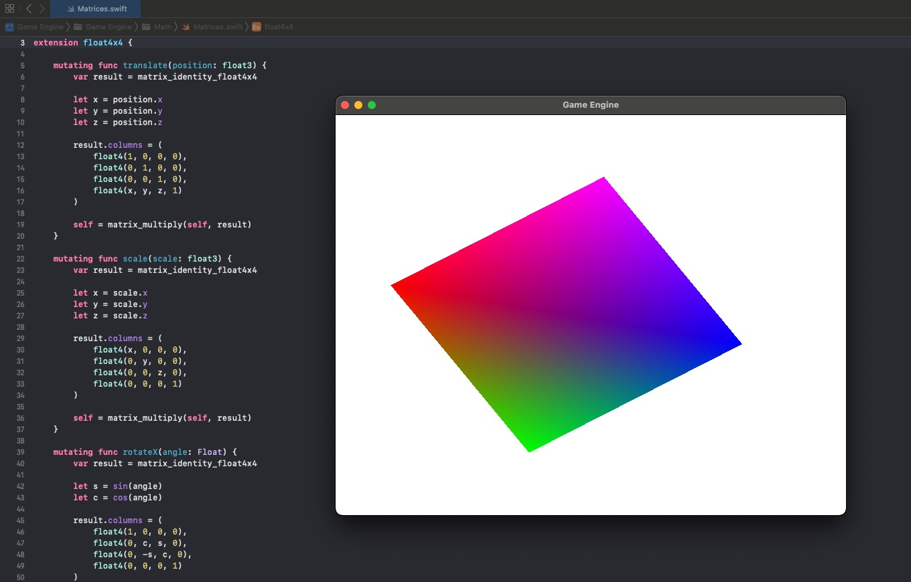

# Part 7: 3D Affine Transformation Matrices

[Back to Readme](../../README.md)

## References

- [Metal Render Pipeline tutorial series by Rick Twohy](https://www.youtube.com/playlist?list=PLEXt1-oJUa4BVgjZt9tK2MhV_DW7PVDsg)
- [Spatial Transformation Matrices](https://www.brainvoyager.com/bv/doc/UsersGuide/CoordsAndTransforms/SpatialTransformationMatrices.html)

---

## Table of Content

- [Translation](#translation)
- [Scaling](#scaling)
- [Rotation](#rotation)
- [Shader](#shader)
- [Result](#result)

---

## Translation

The Affine **translation** **matrix** allows to transform the **position** of the game object.

```swift
mutating func translate(position: float3) {
    var result = matrix_identity_float4x4

    let x = position.x
    let y = position.y
    let z = position.z

    result.columns = (
        float4(1, 0, 0, 0),
        float4(0, 1, 0, 0),
        float4(0, 0, 1, 0),
        float4(x, y, z, 1)
    )

    self = matrix_multiply(self, result)
}
```

---

## Scaling

The Affine **scaling** **matrix** allows to transform the **scale** of the game object.

```swift
mutating func scale(scale: float3) {
    var result = matrix_identity_float4x4

    let x = scale.x
    let y = scale.y
    let z = scale.z

    result.columns = (
        float4(x, 0, 0, 0),
        float4(0, y, 0, 0),
        float4(0, 0, z, 0),
        float4(0, 0, 0, 1)
    )

    self = matrix_multiply(self, result)
}
```

---

## Rotation

The **rotation** **matrix** depends on the **axis** of **rotation** and the **angle** of rotation.

These matrices introduce the **gimbal lock** problem, which is solved by using **Quaternions** for rotations, but for now this is enough.

```swift
mutating func rotateX(angle: Float) {
    var result = matrix_identity_float4x4

    let s = sin(angle)
    let c = cos(angle)

    result.columns = (
        float4(1, 0, 0, 0),
        float4(0, c, s, 0),
        float4(0, -s, c, 0),
        float4(0, 0, 0, 1)
    )

    self = matrix_multiply(self, result)
}

mutating func rotateY(angle: Float) {
    var result = matrix_identity_float4x4

    let s = sin(angle)
    let c = cos(angle)

    result.columns = (
        float4(c, 0, -s, 0),
        float4(0, 1, 0, 0),
        float4(s, 0, c, 0),
        float4(0, 0, 0, 1)
    )

    self = matrix_multiply(self, result)
}

mutating func rotateZ(angle: Float) {
    var result = matrix_identity_float4x4

    let s = sin(angle)
    let c = cos(angle)

    result.columns = (
        float4(c, s, 0, 0),
        float4(-s, c, 0, 0),
        float4(0, 0, 1, 0),
        float4(0, 0, 0, 1)
    )

    self = matrix_multiply(self, result)
}
```

---

## Shader

The **MeshRenderer** now also keeps a **transformation matrix**, called the **model matrix**, to represent the transformations for the **vertices**, given the **position**, **scale** and **rotation** of the **transform**.

It also passes it down to the **CPU** so it can use it to transform the vertices.

The struct holding the model constants is passed by value, as bytes, in a buffer for the **CPU**.

Here we do **updateModelConstants()** as part of the rendering, it should be part of the **update()** stage for optimization purposes. For simplicity we will do it here, to avoid issues with order of execution of the components in the game object.

We will also need to take into consideration parent transforms in the future.

```swift
class MeshRenderer : Component, Renderable {

    private var _modelConstants: ModelConstants! = ModelConstants()

    ...

    func updateModelConstants() {
        var modelMatrix: float4x4 = matrix_identity_float4x4

        modelMatrix.translate(position: gameObject.position)
        modelMatrix.scale(scale: gameObject.scale)

        modelMatrix.rotateX(angle: gameObject.rotation.x)
        modelMatrix.rotateY(angle: gameObject.rotation.y)
        modelMatrix.rotateZ(angle: gameObject.rotation.z)

        _modelConstants.modelMatrix = modelMatrix
    }

    func doRender(renderCommandEncoder: MTLRenderCommandEncoder) {

        updateModelConstants()

        // set the transformation matrix
        renderCommandEncoder.setVertexBytes(&_modelConstants, length: ModelConstants.stride, index: 1)

        renderCommandEncoder.setRenderPipelineState(RenderPipelineStateCache.getPipelineState(.Basic))
        renderCommandEncoder.setVertexBuffer(_vertexBuffer, offset: 0, index: 0)
        renderCommandEncoder.drawPrimitives(type: MTLPrimitiveType.triangle, vertexStart: 0, vertexCount: _mesh.vertices.count)
    }
}
```

In the **Shader** code, we define the same structure, and we add a new parameter to the vertex function.

By doing a **matrix multiplication** between the **model matrix** and the **vertex position** in **object space**, we get the new transformed position of the vertex.

```c
struct ModelConstants {
    float4x4 modelMatrix;
};

vertex FragmentData basic_vertex_shader(
  // metal can infer the data because we are describing it using the vertex descriptor
  const VertexData IN [[ stage_in ]],
  constant ModelConstants &modelConstants [[ buffer(1) ]]
){
    FragmentData OUT;

    // return the vertex position in homogeneous screen space
    OUT.position = modelConstants.modelMatrix * float4(IN.position, 1);

    OUT.color = IN.color;

    return OUT;
}
```

---

## Result

Now the mesh translates, scales and rotates.


