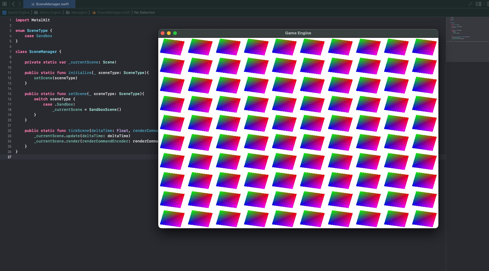

# Part 8: Scenes

[Back to Readme](../../README.md)

## References

- [Metal Render Pipeline tutorial series by Rick Twohy](https://www.youtube.com/playlist?list=PLEXt1-oJUa4BVgjZt9tK2MhV_DW7PVDsg)

---

## Table of Content

- [Scene](#scene)
- [Scene Manager](#scene-manager)
- [Testing Objects](#testing-objects)
- [Result](#result)

---

## Scene

The **Scene** will also be a **Transform** object, it will be the **root** transform of the scene.

```swift
class Scene : Transform {

    override init(){
        super.init()
        buildScene()
    }

    func buildScene() {}
}
```

---

## Scene Manager

The **Scene Manager** will be in charge of holding the current scene, in the future it can implement transitions between scenes, and handling loading and unloading of resources.

It also offers a public function to update and render the current scene.

```swift
enum SceneType {
    case Sandbox
}

class SceneManager {

    private static var _currentScene: Scene!

    public static func initialize(_ sceneType: SceneType){
        setScene(sceneType)
    }

    public static func setScene(_ sceneType: SceneType){
        switch sceneType {
            case .Sandbox:
                _currentScene = SandboxScene()
        }
    }

    public static func tickScene(deltaTime: Float, renderCommandEncoder: MTLRenderCommandEncoder) {
        _currentScene.update(deltaTime: deltaTime)
        _currentScene.render(renderCommandEncoder: renderCommandEncoder)
    }
}
```

This can later be used in the Game View Renderer class, to decouple it from scene initialization.

```swift
extension GameViewRenderer: MTKViewDelegate {

    func mtkView(_ view: MTKView, drawableSizeWillChange size: CGSize) {
        // when the window is resized
    }

    func draw(in view: MTKView){
        ...

        SceneManager.tickScene(deltaTime: 1.0 / Float(view.preferredFramesPerSecond), renderCommandEncoder: renderCommandEncoder!)

        renderCommandEncoder?.endEncoding()
        commandBuffer?.present(drawable)
        commandBuffer?.commit()
    }
}
```

---

## Testing Objects

To setup our **testing scene**, we can make use of all the **testing classes** we have created which inherit from our base classes.

```swift
class MoveComponent : Component, Updatable {

    var time: Float = 0

    func doUpdate(deltaTime: Float) {
        time += deltaTime

//        gameObject.position = float3(cos(time), gameObject.position.y, gameObject.position.z)
//        gameObject.scale = float3(repeating: sin(time))
        gameObject.rotation = float3(gameObject.rotation.x, gameObject.rotation.y, sin(time))
    }
}

class QuadGameObject : GameObject {

    override init() {
        super.init()

        let meshRenderer = MeshRenderer(mesh: MeshCache.getMesh(.Quad))
        self.addComponent(component: meshRenderer)

        let moveComponent = MoveComponent()
        self.addComponent(component: moveComponent)
    }
}

class SandboxScene : Scene {

    override func buildScene() {

        for y in -5..<5 {
            for x in -5..<5 {
                let gameObject = QuadGameObject()

                gameObject.position.y = Float(Float(y) + 0.5) / 5
                gameObject.position.x = Float(Float(x) + 0.5) / 5
                gameObject.scale = float3(repeating: 0.15)

                addChild(transform: gameObject)
            }
        }
    }
}
```

The Game Engine can then initialize itself with a sandbox scene by default.

```swift
class Engine {

    public static func initialize(device: MTLDevice){

        ...

        SceneManager.initialize(Preferences.InitialScene)
    }
}
```

---

## Result

Now the scene contains lots of game objects and all **update** and **render** accordingly.


