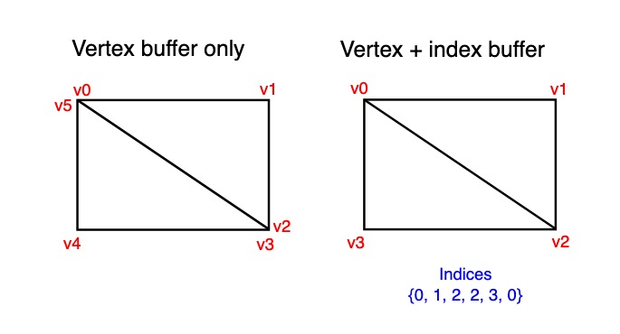

# Part 9: Index Buffers

[Back to Dev Log](../README.md)

## References

- [Metal Render Pipeline tutorial series by Rick Twohy](https://www.youtube.com/playlist?list=PLEXt1-oJUa4BVgjZt9tK2MhV_DW7PVDsg)
- [Index Buffer](https://vulkan-tutorial.com/Vertex_buffers/Index_buffer)

---

## Table of Content

- [Mesh Indices](#mesh-indices)
- [Index Buffer](#index-buffer)
- [Draw Indexed Primitive](#draw-indexed-primitive)

---

## Mesh Indices

The **Mesh** now also sets an array of indices to go along the array of vertices.

This allows to eliminate duplicates and optimize memory utilization.



[Image Source 🔗](https://vulkan-tutorial.com/Vertex_buffers/Index_buffer)

```swift
class Mesh {
    public var vertices: [Vertex]! = []
    public var indices: [UInt32]! = []

    init(){
        createMesh()
    }

    func createMesh() {}
}
```

---

## Index Buffer

The **Mesh Renderer** will create another **MTLBuffer** to send these indexes to the **GPU**.

```swift
class MeshRenderer : Component, Renderable {

    ...

    private var _vertexBuffer: MTLBuffer!
    private var _indexBuffer: MTLBuffer!

    ...

    init(mesh: Mesh) {
        _mesh = mesh

        _vertexBuffer = Engine.device.makeBuffer(bytes: _mesh.vertices, length: Vertex.stride * _mesh.vertices.count, options: [])

        if(_mesh.indices.count > 0){
            _indexBuffer = Engine.device.makeBuffer(bytes: _mesh.indices, length: UInt32.stride * _mesh.indices.count, options: [])
        }
    }
}
```

---

## Draw Indexed Primitive

The **Mesh Renderer** will draw the primitives by sending the indices as instructions on how to interpret the vertices to draw the triangles.

```swift
func doRender(renderCommandEncoder: MTLRenderCommandEncoder) {

    ...

    if(_mesh.indices.count > 0){
        renderCommandEncoder.drawIndexedPrimitives(
            type: MTLPrimitiveType.triangle,
            indexCount: _mesh.indices.count,
            indexType: MTLIndexType.uint32,
            indexBuffer: _indexBuffer,
            indexBufferOffset: 0,
            instanceCount: 1 // for now, might change in the future
        )
    } else {
        renderCommandEncoder.drawPrimitives(
            type: MTLPrimitiveType.triangle,
            vertexStart: 0,
            vertexCount: _mesh.vertices.count
        )
    }
}
```
